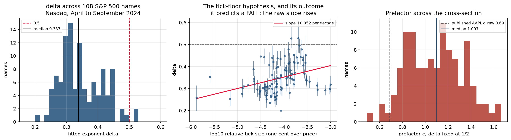

# Intraday impact modelling on Databento XNAS.ITCH

Fifteen symbol-days of Nasdaq order-by-order data, used to answer four questions
about temporary impact: how well can it be predicted for a specific order, what
functional form does the displayed book actually have, where does impact stop
being square-root, and does order flow say anything trade flow does not.

**The sample is 15 symbol-days on three names in 2024**: MSFT, INTC and AAPL,
five sessions each, on a selection rule fixed before any result was looked at.
Section 7 is the one exception, and it is a narrow one: a cross-section of 108
S&P 500 names on the Nasdaq venue only, April to September 2024, built from
trades rather than the book. It is the only cross-sectional statement in this
repository and it is not a market-wide one.
The fifteen-session panel does not include August 5 or deliberately sample
macro-announcement days. The six-month cross-section includes scheduled
announcements and is not filtered into regimes.
In the fifteen-session panel, INTC 2024-08-02, is a single-name event day (the post-earnings
collapse), and it behaves differently from the other fourteen in almost every
table below, which is said where it happens. Results remain limited to the
stated panel or cross-section and do not establish population or regime effects.

---

## Audit correction: returns are not price levels

**On the same fifteen symbol-days, the old 100 ms relaxation and scheduling
conclusions are withdrawn.** The regression fits returns. Its lag coefficients
measure further price changes, while surviving price displacement is their
cumulative sum. From the committed fitted means:

| horizon | old quantity, return response / initial | corrected level response / initial |
|---|---:|---:|
| 100 ms | +0.002048 | **1.002048** |
| 1 second | -0.005938 | **0.960109** |
| 2 seconds | -0.006563 | **0.917296** |

These are descriptive means over fifteen sessions, not causal effects. There
is no cumulative confidence interval: the committed marginal intervals do not
identify covariance across lags. The last supported horizon is two seconds.
Zero additional return does not imply zero remaining impact.
[Full diagnostic](reports/kernel_audit/return_vs_level.csv),
[audit and limits](docs/kernel_audit.md), and
[verified literature through 2026-09-06](docs/literature_audit_2026.md).

```bash
python scripts/audit_kernel_response.py --check
```

This command uses only committed aggregates and the Python standard library.
The earlier schedule runner now refuses to publish costs until level response,
execution-price convention and horizon are consistent. The conditional-impact
comparison below already accumulates returns correctly; its existing numbers
are retained. **What failed was the interpretation of return coefficients as
lasting impact, and the execution claim built on it.**

## Three different R-squareds, and which one is which

Impact studies report a number called R². It is usually the first of these, and
the first is the one a desk can do least with.

| | what it asks | can it be traded | this repo |
|---|---|---|---|
| **Contemporaneous R²** | how much of the price change over a bin does flow *in that same bin* explain | **No.** The flow is not known until the bin is over. It describes; it cannot be acted on. | 0.198 to 0.542 across sessions |
| **Predictive R², selected validation** | how much of the price change does *past* flow explain | **Yes, in principle.** This is the number that would be alpha. | −0.0010 to +0.0056. Positive on 11 of 15; the same tail selected the specification |
| **Conditional impact accuracy** | given an order's size and the seconds it executed over, how close was the *predicted* impact to the *realised* impact of that order, out of sample | **This is what an execution model is for.** Not alpha; cost. | best model reaches median R² 0.21 and is calibrated to within 10% at the top decile |

The README leads with the second and the third. The first is reported because it
is large and because leaving it out would be its own kind of dishonesty, but a
contemporaneous R² of 0.4 is not a signal, and the ratio between the first two
columns, 86x on the first session studied here and at least 10x on all fifteen,
is the single most important thing in this repository.

```bash
pip install -r requirements.txt
python -m pytest tests -q
```

---

## 1. Distributed-lag return response, and how well it prices a specific order

`propagator.py` calibrates a distributed-lag return regression

    r_t  =  sum_{l=0..L} b(l) * sign(v_{t-l}) * |v_{t-l}|^delta  +  noise

on one-second bars built from Databento MBO. The descriptive panel chooses
`(delta, L)` using the last 30% and reports that same selected-validation
score. It has no untouched test window. The conditional-impact comparison
below instead selects inside training before evaluating its separate last 30%.
The retained code field `kernel` denotes return coefficients b; cumulative b
is the corresponding level response.

### The headline: conditional impact accuracy

The table below is the corrected `outcome-end-v3` reproduction. Every
reconstructed metaorder starting inside the held-out last 30% of a session gets
a predicted impact from a kernel fitted strictly inside the first 70%, using
only that order's own flow. R² is of realised on predicted with **no refit**:
the model's own number, not a line drawn through it afterwards. Training
calibration requires each order's outcome to finish before the split. Eight
orders cross that boundary and are excluded from both training and evaluation.

| model | what it gets to fit in sample | median OOS R² | median slope of realised on predicted |
|---|---|---:|---:|
| propagator, kernel straight off the bars | the whole kernel, on one-second flow | **−2.04** | 0.334 |
| propagator, rescaled on training metaorders | kernel shape, plus one level | **−0.02** | 0.52 |
| square root, `I = c σ_D √(Q/V)` | one level, c | **−0.33** | 0.52 |
| square root, σ from the trailing 30 minutes | one level, c | **+0.12** | 1.23 |

Corrected reports, split diagnostics, and committed-input hashes are in
`reports/conditional_impact_corrected/`. The pre-repair files remain unchanged
in `reports/conditional_impact/` as historical evidence. Rebuild and compare
the corrected files with
`python scripts/run_conditional_impact.py --check`.
The exclusions do not change the four headline rows above at their displayed precision;
across all eight models, the largest absolute change in median R² is 0.00033.
That stability is a corrected reproduction result, not an assumption that the
old files survived the cutoff repair. Version 3 also fixes numerical tie handling
in calibration bins: integer midpoint ranks keep 12-significant-digit ties
together, without rounding scored predictions. Counts and input hashes must
match exactly; fitted floats use the tolerances recorded in `methodology.csv`.
The tables below are regenerated from these corrected outputs.

Four things fall out of that table.

1. **A propagator calibrated on bar flow does not transfer to order flow.** Its
   level is wrong by a factor of roughly two and its R² is deeply negative on 14
   of 15 sessions. The kernel is fitted so that `G(0)` explains a whole second's
   aggregate flow; applied to one participant's share of that second it
   over-predicts, and the concavity transform makes it worse, since `|v|^0.25`
   barely distinguishes one participant's volume from everyone's.
2. **The kernel's shape is worth something once the level is fixed.** Give the
   propagator a single scale fitted on training metaorders, the same one
   parameter the square-root model gets, and it beats the square-root model on
   **13 of 15 sessions**, with a pooled calibration ratio between 0.77 and 1.01
   across the middle eight deciles.
3. **The standard square-root model is about 2x miscalibrated intraday**, and the
   direction is systematic: slope 0.52, so a coefficient fitted on the morning
   over-predicts the afternoon roughly twofold. The cause is measurable rather
   than speculative. One-second realised volatility in the held-out window is a
   median 0.63 of the training window's, the slope is a median 0.52, and the two
   correlate at 0.68 across sessions. The model holds σ at a daily constant
   while the market it is applied to gets quieter through the day.
4. **Replacing σ_D with a causal trailing estimate gets the sign of the error
   right but overshoots.** Volatility over the 30 minutes *before* each order,
   available at decision time with no look-ahead, turns the median R² from
   −0.33 to **+0.12**. It over-corrects: the slope goes to 1.23 and the pooled
   decile ratios sit near 1.5, so the trailing one-second estimate falls through
   the day faster than impact does. The calibrated answer is between the two,
   and the next subsection finds it.

Pooled calibration by predicted-impact decile, propagator with a fitted level:

| decile | predicted | realised | ratio | n |
|---:|---:|---:|---:|---:|
| 0 | 0.000017 | 0.000014 | 0.82 | 4,711 |
| 2 | 0.000037 | 0.000028 | 0.77 | 5,348 |
| 4 | 0.000053 | 0.000046 | 0.87 | 4,846 |
| 6 | 0.000080 | 0.000081 | 1.01 | 4,770 |
| 8 | 0.000185 | 0.000150 | 0.81 | 4,753 |
| 9 | 0.000405 | 0.000249 | 0.61 | 4,752 |

The top decile is where it fails, and that is the decile a desk cares about: the
largest orders realise 39% less impact than predicted. Corrected full tables are in
`reports/conditional_impact_corrected/`.

### Which volatility belongs in the square-root model

Two more causal candidates, each fitted on the first 70% of a session and scored
on exactly the same held-out orders as the four above.

**A geometric blend**, `σ_D^α · σ_trail^(1−α)`, with α fitted in sample on the
training metaorders.

**A time-of-day profile**, `σ_D` times a half-hour multiplier: the median ratio
of one-second realised volatility in each half hour to the whole day's. That
multiplier cannot come from the scored session's own training window, because
the training window is the first 70% of the day and every held-out order starts
in a half hour it never reaches. It is estimated from other sessions of the
**same symbol**, never across symbols, in two variants: `loso` uses the symbol's
other four sessions, which is cross-validated but not strictly causal since some
donors are later days, and `prior` uses only sessions before the scored one,
which is strictly causal and leaves the earliest session of each symbol
unscored.

| model | sessions | median OOS R² | mean R², band by symbol-day | median slope | top-decile ratio |
|---|---:|---:|---|---:|---:|
| propagator | 15 | -2.035 | [-14.319, -3.000] | 0.334 | 0.289 |
| propagator, rescaled | 15 | -0.017 | [-0.391, 0.088] | 0.524 | 0.615 |
| square root, σ_D | 15 | -0.327 | [-0.466, -0.081] | 0.519 | 0.636 |
| square root, σ trailing 30 min | 15 | 0.120 | [0.069, 0.161] | 1.234 | 1.386 |
| **square root, geometric blend** | 15 | 0.044 | [-0.099, 0.142] | 0.615 | 0.710 |
| **square root, time-of-day (loso)** | 15 | 0.176 | [0.160, 0.238] | 0.834 | 1.011 |
| **square root, time-of-day (prior only)** | 12 | 0.206 | [0.160, 0.255] | 0.955 | 1.097 |
| square root, rate term | 15 | -0.257 | [-0.331, -0.008] | 0.569 | 0.669 |

**The time-of-day profile wins, and the blend loses to the row it was built
from.** Three things to read off it.

- **The top decile is no longer over-predicted.** The plain square-root model
  over-predicts the largest orders by 57% (ratio 0.636); the time-of-day model
  lands at **1.011** on the leave-one-session-out variant and 1.097 on the
  strictly causal one, so its calibration ratios are about 1% and 10% from one
  where a desk actually cares. Neither is a tuned result: the multiplier is a
  shape borrowed from other days and nothing in it was fitted to the top decile.
- **The strictly causal variant has median R² 0.206 on 12 sessions** with a
  prior donor. The leave-one-session-out value 0.176 uses 15 sessions, so these
  two medians do not establish that excluding later donors improves accuracy
  on a matched sample.
- **The blend is worse than the trailing-volatility endpoint**, median R² 0.044
  against 0.120 for pure trailing σ, and the reason is visible in α: it comes
  out at a mean of **0.720** (range 0.430 to 0.970), leaning heavily on daily σ.
  Fitting α in sample picks too much daily σ because *in the training window the
  daily constant is not yet wrong*. The error it is meant to correct only appears
  in the window it is not fitted on. This is a clean example of an in-sample
  criterion selecting the wrong model for an out-of-sample job, and it is
  reported because it went the wrong way.

### Does the rate of execution matter

Zarinelli, Treccani, Farmer and Lillo
([2015](https://arxiv.org/abs/1412.2152)) find that impact depends on how fast
an order is worked, not only on its size, with a logarithmic correction:

    I / σ = c (Q/V)^δ (1 + k log rate)

`rate` here is Q over the total volume traded during the order's own execution
window, so it is 1 when the order was the only thing that traded and small when
it was a minor part of a busy stretch. Its median on the held-out orders is
**0.422**. All three parameters are fitted on the training 70% at a constant
daily σ, so the contrast against the plain square-root row is the rate term and
nothing else.

| | value |
|---|---|
| k, mean over 15 sessions | **+0.0742** |
| band by symbol-day | **[+0.0536, +0.0907]** |
| distinguishable from zero | **yes**, the band excludes it |
| sign | **positive** on 14 of 15 sessions |
| median OOS R² | −0.257, against −0.327 without the term |
| top-decile ratio | 0.669, against 0.636 without the term |

**The rate term is real, correctly signed, and too small to matter.** Positive k
means impact rises with the rate of execution, which is the direction Zarinelli
and co-authors report, and the band excludes zero comfortably. But it moves the
median R² from −0.327 to −0.257 and the top-decile calibration ratio from 0.636
to 0.669, against 1.011 for simply putting the right volatility in. For
reference the rescaled propagator's top decile sits at 0.615. **On this data the
level of σ is worth an order of magnitude more than the rate of execution**, and
a desk fixing one thing should fix the volatility.

### The two-day numbers, restated across fifteen sessions

The figures this repo used to lead with (explanatory R² 0.366 and 0.432,
predictive 0.004 and 0.005, metaorder exponent 0.370) were each **one
symbol-day**. The same code on fifteen reproduces them exactly on the sessions
they came from, and puts them in context:

| | MSFT | INTC | AAPL |
|---|---|---|---|
| contemporaneous selected-validation R², range | 0.198 to 0.437 | 0.364 to 0.542 | 0.309 to 0.437 |
| mean, bootstrap band by symbol-day | 0.293 [0.212, 0.375] | 0.437 [0.387, 0.495] | 0.371 [0.327, 0.415] |
| predictive selected-validation R², range | −0.0010 to 0.0045 | −0.0004 to 0.0046 | −0.0002 to 0.0056 |
| mean, bootstrap band | 0.0016 [−0.0005, 0.0037] | 0.0020 [0.0006, 0.0035] | 0.0016 [0.0003, 0.0036] |
| metaorder exponent, range | 0.318 to 0.398 | 0.209 to 0.467 | 0.286 to 0.487 |
| mean, bootstrap band | 0.351 [0.327, 0.376] | 0.335 [0.264, 0.409] | 0.357 [0.299, 0.432] |

- The **explanatory-versus-predictive gap holds on 15 of 15 sessions** (the
  contemporaneous R² is at least ten times the absolute predictive one every
  time). This is the finding that survives the panel.
- Predictive selected-validation R² is **positive on 11 of 15**; on the other four the best
  lagged model is worse than predicting the mean.
- Adding lagged history to the contemporaneous model buys a median +0.0031 and
  at most +0.0154. This measures marginal return predictability. It does not identify a
  price-level relaxation horizon.
- The metaorder exponent is **below 0.5 on 15 of 15**, mean 0.348, bootstrap
  band by symbol-day [0.314, 0.382]. The single-session 0.370 was not unusual;
  what it lacked was the range around it.

The per-stock means differ by less than the within-stock spread. Reading the
INTC-versus-MSFT contrast as a large-tick-versus-small-tick effect, as an
earlier version of this README did, does not survive five sessions each.

```bash
python scripts/run_conditional_impact.py
python scripts/run_propagator_panel.py
```

---

## 2. The original functional form, refitted without filtering

The work-trial notebook fitted `g(x) = a x^p` to the cost of walking a displayed
ask ladder and reported **p ≈ 0.45**. That number is retired. Its figures are
gone from this README; the refit below is on Databento MBP-10, on all fifteen
sessions, with nothing filtered.

`bookwalk.py` walks both sides of the vendor's ten displayed levels at the last
book state of every RTH second, about 23,300 snapshots a session, over a fixed
log grid of sizes in shares, filling the marginal level partially. **x is capped
by displayed depth**: a snapshot contributes to size x only if its ten levels
hold x shares, so every fit below is valid strictly inside the displayed-depth
range, and the `participating` column records the fraction of snapshots that
qualify at each size.

### (a) What the filter was worth

The notebook's recipe made three choices at once: integer-share buckets of the
premium over the best *ask*, every bucket above 1,000 shares dropped, and
survivors weighted equally regardless of how many snapshots they held.

| | filtered, as published | unfiltered | unfiltered, count-weighted |
|---|---:|---:|---:|
| mean exponent across 15 sessions | 0.355 | 0.334 | 0.595 |
| range | **−0.061 to 0.581** | 0.149 to 0.569 | 0.416 to 0.760 |
| standard deviation | 0.180 | 0.121 | 0.082 |

The filter does not move the exponent so much as destroy its stability. The
1,000-share cap discards a **median 73.8% of observations**, and on the
large-tick name it is catastrophic: INTC has 2,500 to 4,200 shares at the touch
alone, so the cap keeps only the first level or two. On INTC 2024-10-01 it
leaves **37 buckets out of 72,234, discarding 99.98% of the data, and the fitted
exponent comes out negative.** Count-weighting the surviving buckets, the
third column, is a separate choice and moves the mean by more than the cap does.

### (b) Nine normalisations, all reported

| size | cost | exponent | robust SE | bootstrap 95% | weighted R² |
|---|---|---:|---:|---|---:|
| shares | bp of mid | 0.533 | 0.012 | [0.473, 0.584] | 0.851 |
| shares | σ_D | 0.312 | 0.017 | [0.230, 0.379] | 0.714 |
| shares | half-spreads | 0.273 | 0.008 | [0.242, 0.331] | 0.668 |
| x / ADV | bp of mid | 0.564 | 0.018 | [0.502, 0.639] | 0.824 |
| x / ADV | σ_D | 0.336 | 0.020 | [0.255, 0.404] | 0.749 |
| x / ADV | half-spreads | 0.295 | 0.009 | [0.260, 0.345] | 0.679 |
| x / D_t | bp of mid | 0.200 | 0.029 | [0.160, 0.243] | 0.149 |
| x / D_t | σ_D | 0.220 | 0.017 | [0.192, 0.254] | 0.479 |
| **x / D_t** | **half-spreads** | **0.234** | **0.015** | **[0.203, 0.268]** | **0.595** |

ADV is the trailing 20-day Nasdaq average daily volume; D_t is the displayed
size at the touch in that snapshot; σ_D is the trailing 20-day close-to-close
volatility.

Both axes move the exponent and neither is a free choice. Sizes in shares and in
ADV differ only by a per-session constant, so they nearly agree; dividing by D_t
does not, because displayed depth varies second by second and dividing by it
removes exactly the part of the size the book was deep enough to absorb cheaply.
On the cost side, only a *global* constant rescale leaves an exponent alone: σ_D
is constant within a session but differs across them, and the half-spread varies
snapshot by snapshot, so both reweight the pooled fit.

**The range across the nine is 0.200 to 0.564, and 0.45 sits inside it.** That is
the finding. The work-trial number was one cell of this table reported as the
answer.

The bottom row is the pooled fit, and it is the only kind of pooling that is
legitimate: both axes dimensionless, as `impact_model.py`'s docstring requires.
A cost in basis points is *not* scale-free across a $21 large-tick name and a
$420 small-tick one, which is why the `x/D_t` and bp row has a weighted R² of
0.15, where the pooled fit is mostly fitting the difference between the names.

### (c) Five forms, scored by cross-validation and AIC

Pooled, `u = x/D_t`, `y` in half-spreads, 600 bins over 15 symbol-days. Weighted
nonlinear least squares with bin-count weights and HC0 sandwich errors; folds
are whole symbol-days, because bins inside one session share a book and a random
split would leak.

| form | parameters | exponent | LOSO RMSE | ΔAIC |
|---|---|---:|---:|---:|
| **piecewise flat + power** | c=1.00, u₀=0.0795, p=0.245 | 0.245 [0.214, 0.280] | **1.074** | **0** |
| power law | a=1.93, p=0.234 | 0.234 [0.203, 0.268] | 1.088 | 17.6 |
| ATHL, β free | η=1.93, β=0.234 | 0.234 [0.203, 0.268] | 1.088 | 17.6 |
| logarithmic | k=0.864, u₀=0.139 | none | 1.098 | 26.2 |
| ATHL, β = 3/5 | η=0.363 | fixed at 0.6 | 1.915 | 712.9 |
| linear | b=0.0252 | fixed at 1 | 2.360 | 966.4 |

The original piecewise form wins, on both criteria, and the reason is specific:
its fitted breakpoint is **u₀ = 0.0795, not 1**. The model as written in
`impact_model.py` puts the flat region at exactly one unit of displayed depth;
the data puts it at about a *twelfth* of it. The flat cost `c` comes out at
1.000 half-spreads, which is the model's own consistency check passing (walking
zero shares costs exactly the half-spread) and is not fitted to be so.

Linear impact is rejected decisively (ΔAIC 966) and so is Almgren, Thum,
Hauptmann and Li's β = 3/5 (ΔAIC 713). Per symbol the exponents are AAPL 0.273,
INTC 0.284, MSFT 0.169, and on AAPL alone the logarithmic form wins the
cross-validation.

**Truncation bias, measured.** At large x only the deepest snapshots can fill,
and deep books are cheap to walk, so the measured curve flattens and the
exponent is biased down. Restricting to bins where at least 90% of snapshots had
the depth, 505 of 600 bins, moves the exponent **0.234 to 0.334**. That is the
largest single correction in this section and it goes the way the bias predicts.

### (d) Is the exponent identified?


| | |
|---|---|
| point estimate | 0.234 |
| HC0 robust standard error | 0.015 |
| profile 95% interval | [0.220, 0.240] |
| **block bootstrap 95% interval, by symbol-day** | **[0.203, 0.268]** |
| profile deviance at p = 0.4 / 0.5 / 0.6 | 309 / 536 / 697 (χ²(1) cutoff 3.84) |

Yes, and easily. The profile is sharply curved: 0.4, 0.5 and 0.6 are rejected by
two orders of magnitude more than the χ² cutoff. **The data separates 0.23 from
0.45 without difficulty, and 0.45 lies outside every interval in this section.**

What the profile is not is an honest interval. It is **3.2x narrower than the
block bootstrap**, because it treats 600 bins as 600 independent observations
when they are 15 sessions. Quote the bootstrap. The robust standard error, for
once, happens to agree with it.

### What this measures, and what it does not

Walking a displayed book measures the **virtual instantaneous cost of consuming
visible liquidity at an instant**: no hidden size, no queue refill, no adverse
selection, no time dimension at all. It is **not a general bound** on realised impact: refill, hidden liquidity,
price moves and the execution schedule can change cost in either direction.
It is in its own section, away from the metaorder results, for that reason, and
none of the exponents above is a measurement of any square-root law.

```bash
python scripts/run_bookwalk.py
```

---

## 3. Metaorders: where the square root starts, and a published comparison

`metaorder_impact.py` measures impact against participation rate on proxy
metaorders, maximal runs of same-signed fills.
[arXiv 2503.18199](https://arxiv.org/abs/2503.18199) motivates research using
public-flow proxies; these simple runs are not an implementation of that
paper's full reconstruction algorithm. Across the fifteen
sessions the fitted exponent is **0.209 to 0.487, mean 0.348, below 0.5 every
time**.

### The crossover

Bucci, Benzaquen, Lillo and Bouchaud
([PRL 122, 108302, 2019](https://www.off-ladhyx.polytechnique.fr/people/benzaquen/publications/Bucci2018crossover.pdf)) argue the square-root
law must break down at small participation, becoming linear below a crossover
where the metaorder is comparable to the volume traded while the book relaxes.
That would explain an exponent below 0.5 with nothing wrong. The competing
explanation is a **discreteness floor**: a one-fill metaorder still moves the mid
by about half a tick, so the smallest bins cannot fall below that level and the
fitted slope flattens.

`crossover.py` fits both regimes joined continuously, with the crossover q\* by
profile likelihood. The two explanations are distinguishable, and the test is
whether the impact *at* the crossover is above one tick.

On the 187,073 fill-run metaorders:

| panel | q\* (fraction of daily volume) | impact there, in ticks | interior estimate? |
|---|---:|---:|---|
| pooled | 8.7e-08 | 0.11 | **no, pinned at the grid floor** |
| AAPL | 6.7e-08 | 0.12 | no |
| INTC | 8.1e-08 | 0.03 | no |
| MSFT | 1.4e-07 | 0.29 | no |

q\* lands at the bottom of the search grid, about **one share**, and the fitted
impact there is **a tenth of a tick**. Both facts say the same thing: there is no
linear regime anywhere in this range, and the range itself lies below the price
grid's own resolution. Bucci's crossover cannot be what produces the 0.348
exponent here. Under their account this range should be *linear*, exponent 1,
and it is nowhere near.

Run the same fit on metaorders large enough to be visible and the crossover
appears:

> On the published-recipe metaorders (1,176 orders, participation 1e-4 and up),
> **q\* = 2.8e-4 of daily volume, with impact at the crossover of 8.2 ticks,
> an interior estimate far above the discreteness floor.**

So both things are true, at different scales. A crossover exists, at about 2.8
parts in ten thousand of daily volume. The fill-run reconstruction lives four
orders of magnitude below it, entirely inside the tick floor, and **the sub-0.5
exponent it produces is the floor, not the crossover.** That is the explanation
this analysis supports.

### Beside a published result

[arXiv 2606.24019](https://arxiv.org/abs/2606.24019) confirms the square-root law
on AAPL over 178 trading days. `crossover.bin_metaorders` implements its recipe:
30-second bins, direction dominance above 0.3, duration at least 60 seconds,
size at least 1e-4 of daily volume, then `I/σ_D = c (Q/V_D)^δ`.

| | c (δ fixed at ½) | δ free |
|---|---|---|
| **published, AAPL, 178 days** | **c_raw 0.69** [0.63, 0.77] | **0.50** [0.32, 0.66] |
| ours, AAPL, 5 days, 250 metaorders | 1.68 [1.08, 2.44] | 0.34 [0.28, 0.44] |
| ours, pooled, 1,176 metaorders | 1.86 [1.55, 2.23] | 0.39 [0.33, 0.48] |
| ours, INTC | 1.52 [1.32, 1.85] | 0.36 [0.25, 0.50] |
| ours, MSFT | 2.58 [2.27, 2.89] | 0.62 [0.56, 0.73] |

Our AAPL exponent, 0.34, is below their 0.50 and its interval **does not contain
0.50**, though the two intervals overlap between 0.32 and 0.44. Our prefactor is
**2.4x theirs**, and that gap is not explained by the venue-volume convention:
using consolidated rather than Nasdaq volume would raise our c further, not lower
it. Five days against 178 is the obvious candidate, and MSFT's 0.62 against
AAPL's 0.34 shows how much of that spread is available across three names.

Their bias-corrected prefactor, c_eff 0.34, is **not recomputed here**. The
abstract states it without stating the correction, and inventing a correction
that lands on 0.34 would be fitting to the answer.

### Two limits that do not go away

Proxy metaorders merge concurrent participants trading the same way and split a
single participant who pauses. Naviglio, Bormetti, Campigli, Rodikov and Lillo
([arXiv 2501.17096](https://arxiv.org/abs/2501.17096)) show that models fitted to
anonymised public flow produce price trajectories that are linear during
execution rather than concave, precisely because they misspecify where order-flow
autocorrelation comes from. A maximal same-signed run is an assumption about
which fills share a parent, and that assumption is the load-bearing one.

```bash
python scripts/run_crossover.py
```

---

## 4. Scheduling: historical result withdrawn after the kernel audit

**Scope: fifteen symbol-days, 1,800 historical model replays over 600-second
windows. These are archived outputs, not validated execution costs.**
[The retained source tables](reports/schedule/saving_vs_twap.csv) record what
was previously reported; they are not silently overwritten by a different model.

| historical output, 1% order | TWAP | old propagator schedule | Almgren-Chriss |
|---|---:|---:|---:|
| model impact cost per share | $0.002463 | $0.002463 | $0.003824 |
| reported relative saving | n/a | -0.000% | -55.2% |
| remaining-inventory variance / TWAP | 1.000 | 1.000 | 0.486 |

The earlier inference was that an almost instantaneous fitted kernel made
TWAP optimal and front-loading cost 55% more. **That inference is withdrawn.**
`execution.fit_linear_kernel` fits returns, but the runner treated those
coefficients as surviving level impact. Its quadratic objective used half of
instantaneous impact while its exponential replay charged all of it, and a
600-second schedule used zero-padded coefficients fitted over at most 60 seconds.
Those are different cost models even before empirical uncertainty is considered.

The closed-form level-kernel results of
[Gatheral, Schied and Slynko (2012)](https://onlinelibrary.wiley.com/doi/full/10.1111/j.1467-9965.2011.00478.x)
and [Obizhaeva and Wang (2013)](https://web.mit.edu/wangj/www/pap/ObizhaevaWang13.pdf)
remain useful mathematical controls. The tested algebraic helpers are retained
for typed level responses. Raw return coefficients are rejected until
explicitly accumulated, beyond-fit tails require a declared policy, and replay
uses the exact quadratic impact objective optimized by the solver. The
empirical runner still fails before fitting or writing outputs because these
algebra repairs do not justify a causal level-impact model. Neither a better
execution schedule nor the claimed absence of exploitable memory has been
established on this sample.

### The 100 ms evidence, with the estimand corrected

The committed shape table contains means of normalized **return** coefficients
b(l), fitted on 100 ms bars. The preceding section's diagnostic accumulates them
into normalized level response R(l). The old and corrected interpretations are:

| existing observation | earlier inference | corrected inference |
|---|---|---|
| b(1)/b(0) = +0.0020, marginal interval includes zero | relaxation complete within 100 ms | R(1)/R(0) = 1.0020; no evidence of complete level relaxation |
| negative average return coefficients after lag 1 | reversion distinct from impact decay | negative increments are compatible with a declining positive level response |
| selected L above 1 on 12 of 15 sessions | a test of execution memory | selected-validation return fit only |

The old 100 ms [coefficient table](reports/kernel_100ms/kernel_shape.csv) and
[selection table](reports/kernel_100ms/per_session.csv) are retained. The old
`verdict.csv` is a historical interpretation and is withdrawn. The per-lag bands
are marginal and were not corrected for searching across lags; they do not
establish a joint significance claim. Hyperparameters were selected on the same
tail whose R2 was reported. No new model is fitted to that already examined tail.

**What did not work:** neither finer return bars nor the old cost replay
established that impact disappears within 100 ms. A cumulative point estimate
at two seconds is recoverable; its joint uncertainty, causal interpretation and
extension to a ten-minute execution horizon are not recoverable from these
committed summaries alone.

---

## 5. Scheduling under the conditional model

Section 4's schedule is withdrawn and stays withdrawn: this section does not
resurrect a decay kernel, and nothing here uses a horizon past one execution
slice. It reschedules the one model that validated out of sample instead,
`sqrt_tod_prior` from section 1 (median OOS R² 0.206, calibration slope 0.955,
the twelve sessions with a same-symbol prior session), and reports what the
resulting schedule is worth two ways: priced by the same model that built it,
and priced by coefficients fit fresh on held-out metaorders alone.

**Every number below is model-implied or realised-bucket-priced. No schedule
was executed. Nothing here is a realised execution cost.**

### Setup, fixed before any saving was computed

Per session: a parent order of **1% of the trailing 20-day ADV**
(`adv_20d_xnas`, this repo's existing normaliser), executed over the held-out
last 30% of the session in **one-minute slices**
(`impact_model.allocate_schedule`'s own native unit; the held-out window is
116 to 118 minutes on all twelve sessions, so the coarser fallback this script
also implements is never used). A slice of `q` shares in minute `t` costs
`q · c_hat · sigma_t · sqrt(q / V_D)`, in raw log-return units, the same units
as `I = c sigma_D sqrt(Q/V)` in section 1 (multiply by 1e4 for bp): `c_hat` is
`sqrt_tod_prior`'s own calibrated level, `sigma_t` is `sigma_D` times the
strictly causal `prior` time-of-day multiplier `m(t)`, and `V_D` is the SAME
daily session volume `c_hat` was calibrated against in section 1: applying a
validated model slice by slice means keeping its own normaliser. The strictly
causal per-minute volume profile (median, across that symbol's sessions
strictly BEFORE this one, of each donor's own per-minute share of its total
volume, scaled by this session's trailing 20-day ADV; nothing from the scored
session's own volume or a later session enters it) still exists below, but
only to shape the VWAP benchmark, not to price any slice.

`conditional_impact.py`'s one order-level model with a volume/rate term,
`sqrt_rate` (the participation-rate term of Zarinelli, Treccani, Farmer and
Lillo 2015), scores median OOS R² **-0.257** on 15 sessions, median slope
0.569 (`reports/conditional_impact_corrected/model_comparison.csv`): negative
R², so it does not validate and no volume-aware schedule family is built
here. `methodology.csv` records this decision and the score it rests on.

Under this cost, the KKT conditions give a risk-neutral optimum
**`q_t ∝ 1 / m(t)²`** (verified against the closed form in
`tests/test_schedule_conditional.py` to floating-point precision): `V_D` and
`sigma_D` are constants for a given session, so only the time-of-day
multiplier enters the allocation shape. Computed by
`impact_model.allocate_schedule`, the KKT/bisection allocator already in this
repo, through a thin, tested adapter (`_slice_depths`) rather than a second
solver. The inventory-penalised optimum
(`impact_model.allocate_schedule_risk_averse`, the Almgren-Chriss objective
already here) is computed at three risk-aversion values, **0.1×, 1× and 10× a
session-specific `lambda_ref`** that equalises the impact-cost and
inventory-risk terms AT THE TWAP SCHEDULE, so the grid spans near-TWAP to
clearly front-loaded on every session regardless of that session's absolute
scale, fixed by the TWAP baseline alone before any schedule was compared.
Four schedules are compared on identical slices: TWAP, VWAP on the causal
volume profile, KKT risk-neutral, and KKT inventory-penalised at each
risk-aversion value.

**Applying an order-level square-root law slice by slice assumes slice costs
ADD** (`sum_t a_t x_t^1.5`), the Almgren-Chriss temporary-impact convention
and not something this repo has validated: section 1 fitted and scored
`sqrt_tod_prior` on whole reconstructed metaorders, not a sum of one-minute
pieces of one. Those held-out proxy metaorders have a median duration of
**2 milliseconds** and an interquartile range of **0 to 0.7 seconds**
(n=38,046 across the same twelve sessions, `methodology.csv`), sharply below
the one-minute slice used below. Read what follows as an allocation across a
fixed count of one-minute slices, not a claim that this slicing, or any other,
was shown to be cheapest.

### Model-implied saving

Priced with the same `a_t = c_hat sigma_t / sqrt(V_D)` that built the
schedule, so KKT risk-neutral is the cheapest schedule under this pricing by
construction: this is a consistency check on the solver, not independent
evidence.

| schedule | vs | median saving | 95% band, bootstrap by session | sessions beating benchmark |
|---|---|---:|---|---:|
| KKT risk-neutral | TWAP | **+2.5%** | [+2.2%, +3.8%] | 12 / 12 |
| KKT risk-neutral | VWAP | **+39.8%** | [+35.2%, +42.1%] | 12 / 12 |
| KKT, mild front-load (0.1×λ_ref) | TWAP | +2.1% | [+1.8%, +3.5%] | 11 / 12 |
| KKT, mild front-load (0.1×λ_ref) | VWAP | +39.6% | [+34.9%, +41.9%] | 12 / 12 |

Front-loading harder never pays against TWAP: at 1×λ_ref the schedule costs
**15.1% more** than TWAP (median saving -15.1%) and at 10×λ_ref it costs
**127.7% more** (median saving -127.7%), on all 12 sessions, under this same
model-implied pricing. Against VWAP the same grid still shows a gain at
1×λ_ref (median **+29.2%**, band [+24.1%, +31.4%], 12/12) before turning
negative at 10×λ_ref (median **-40.5%**, band [-50.1%, -36.1%], 0/12): VWAP
concentrates volume where the causal profile says the day is
busiest, the calibrated time-of-day shape puts most of this model's own cost
somewhere else, and a schedule built to minimise this model's cost beats VWAP
up to a point before over-front-loading past it. That is exactly what an
Almgren-Chriss objective predicts once nothing in the evaluation rewards
inventory-variance reduction on its own: buying more of it than the model
needs is pure cost.

### Realised-bucket-priced saving, the check that does not depend on the model

Each session's held-out window is split into **half-hour buckets** (the
finest of 30, 60 or 120 minutes, then the whole window, that leaves at least
**30** reconstructed test-window metaorders in every bucket; half an hour was
never too fine, the thinnest bucket on any of the twelve sessions held **86**
orders). `conditional_impact.fit_sqrt_coefficient` is refit, unchanged, on
each bucket's held-out metaorders alone, using the plain daily `sigma_D` and
`V_D`, not the model's time-of-day profile, giving a coefficient the model
never touched. Every schedule is then priced with these coefficients instead
of `c_hat`.

| schedule | vs | median saving | 95% band, bootstrap by session | sessions beating benchmark |
|---|---|---:|---|---:|
| KKT risk-neutral | TWAP | **-7.5%** | [-9.7%, -5.1%] | 0 / 12 |
| KKT risk-neutral | VWAP | **+0.9%** | [-6.6%, +7.2%] | 6 / 12 |
| KKT, mild front-load (0.1×λ_ref) | TWAP | -11.1% | [-12.7%, -7.5%] | 0 / 12 |
| KKT, mild front-load (0.1×λ_ref) | VWAP | -2.0% | [-9.5%, +5.2%] | 6 / 12 |

**The model-implied saving over TWAP does not survive contact with the
realised-bucket pricing, at any risk aversion.** KKT risk-neutral beats TWAP
on 0 of 12 sessions once bucket-level coefficients are fit fresh from
held-out metaorders instead of assumed from the calibrated model, though it
still beats VWAP on 6 of 12. The inventory-penalised schedules do no better:
against TWAP, 0 of 12 sessions at 0.1×, 1× and 10×λ_ref (medians -11.1%,
-39.8%, -182.9%); against VWAP, 6 of 12 at 0.1×λ_ref, falling to 1 of 12 at
1×λ_ref and 0 of 12 at 10×λ_ref. The extra impact cost of front-loading is
real and the model's calibrated time-of-day shape is not accurate enough, on
held-out data, to buy it back.

**The rank correlation is negative on every session, which is expected given
what the two coefficients measure, not fresh evidence against the model.**
Spearman rho between each bucket's realised coefficient and the model's own
time-of-day-implied coefficient is negative on **all 12 of 12 sessions**,
median **-0.40**, range -1.0 to -0.2 (4 buckets a session, so each rho is a
coarse statistic; unchanged by the normaliser fix above, since
`model_bucket_coefficient` never had a volume term to fix). `k_model` is
`c_hat · m(t)`, volume-blind by construction; `k_realised` is fit locally per
bucket with no time-of-day or volume control, so it absorbs whatever actually
moved cost in that bucket, volume included. Pooled across all 48 buckets, the
median reconstructed order count more than triples from the first held-out
half hour to the last (367 to 1,320, `bucket_coefficients.csv`), and `k_model`
rises into the close (rank correlation with bucket position +0.27) while
`k_realised` falls (-0.45): the two move in opposite directions because
`k_model` reflects only the time-of-day volatility multiplier and
`k_realised` reflects everything else moving in that bucket too. That is a
structural mismatch in what the two numbers measure, not a new finding that
`sqrt_tod_prior`'s section-1 calibration is wrong out of sample. **INTC
2024-08-02**, the post-earnings event day flagged throughout this README,
sits at rho -0.40, exactly the panel median: not an outlier on this
particular check.

### What this does and does not establish

- Every saving above is model-implied or realised-bucket-priced. No schedule
  was executed, and nothing here is a realised execution cost.
- No transient or permanent split is used or claimed. The per-slice cost
  treats a one-minute slice's own square-root cost as the whole cost of that
  slice; the two-second support limit in `docs/kernel_audit.md` is exactly why
  nothing beyond one slice is assumed here.
- No volume-aware schedule is reported. `sqrt_rate`, the one order-level model
  in this repo with a volume/rate term, scores negative median OOS R² and was
  not built into a schedule family; see "Setup" above.
- Applying the model slice by slice assumes slice costs add, which this repo
  has not validated, and the held-out proxy metaorders it was calibrated on
  run far shorter than the one-minute slice used here (median 2 ms, IQR 0 to
  0.7 s); see "Setup" above. Read the tables as an allocation across a fixed
  slice count, not as evidence that one-minute slicing is itself validated.
- The sample is the same twelve symbol-days on three names in 2024 as the rest
  of this repository's fifteen-session panel. No population or regime claim.
- The realised-bucket check, which does not depend on the model, favours KKT
  over TWAP on no session and over VWAP on half, and finds a negative rank
  correlation everywhere for structural reasons explained above. **Read the
  model-implied table as what the model would say about itself, and the
  realised-bucket table as the answer to whether that shape is trustworthy out
  of sample: on this panel, it is not.**

Committed outputs are in `reports/schedule_conditional/`:
`session_summary.csv`, `bucket_coefficients.csv`, `schedule_costs.csv` and
`schedule_savings.csv` (tidy, one row per schedule/benchmark/pricing/session),
`pooled_summary.csv`, `methodology.csv` (every pre-registered choice above,
the proxy-metaorder duration check and the volume-aware-family decision,
written down) and `input_manifest.csv`. Rebuild and compare with
`python scripts/run_schedule_conditional.py --check`.

```bash
python scripts/run_schedule_conditional.py
```

---

## 6. Order flow against trade flow

Signed trade volume counts executions. Order flow imbalance counts the whole
displayed book, arrivals and cancellations and executions, so it moves when a
quote is pulled and no trade happens. `orderflow.py` puts both in the same
one-second regressions, on the same 70/30 split. The per-level increment and the
PCA integration are **vendored from `scripts/multi_level_ofi.py` in the sibling
`lob-engine-cpp` repository**, with attribution in the module docstring;
they implement Cont, Kukanov and Stoikov (2014) and Cont, Cucuringu and Zhang
(Quantitative Finance 2023). Two changes are noted at the call site: the CCZ
depth normalisation is applied, and the principal component is fitted on
training rows only.

Both flows enter as `sign(v)|v|^0.5`, **fixed in advance, not selected**. That
choice is forced and the evidence is reported rather than hidden:

| | δ=0.25 | δ=0.5 | δ=0.75 | δ=1.0 |
|---|---:|---:|---:|---:|
| OFI, mean in-sample R² | 0.431 | 0.587 | 0.633 | 0.537 |
| OFI, mean **out-of-sample** R² | 0.261 | **0.361** | 0.215 | **−0.351** |
| trade, mean out-of-sample R² | **0.340** | 0.226 | 0.042 | −0.117 |

For OFI the in-sample fit rises almost to the linear specification while the
held-out fit collapses: on MSFT 2024-04-01, +0.65 in sample and −3.15 out of it. Both flows are heavy-tailed and no inner split rescues the choice, because
whichever window does the choosing has its own extremes. **The standard
specification, linear in OFI, is the one that fails worst out of sample.**

Mean across the 15 symbol-days, bootstrap band by symbol-day, best-level OFI:

| relation | trade alone | OFI alone | both | trade given OFI | **OFI given trade** | OFI wins |
|---|---:|---:|---:|---:|---:|---:|
| contemporaneous | 0.226 [0.160, 0.288] | **0.361** [0.252, 0.457] | 0.385 [0.290, 0.469] | 0.024 [−0.003, 0.050] | **0.159** [0.086, 0.224] | 13/15 |
| predictive | −0.0007 | −0.0002 | −0.0007 | −0.0005 | 0.0000 [−0.0015, 0.0015] | 10/15 |

- **Contemporaneously, OFI subsumes trade flow.** It adds +0.159 given signed
  trade volume; trade volume adds +0.024 given OFI, and that interval contains
  zero. This is consistent with Cont, Cucuringu and Zhang on this limited
  three-name sample; it does not establish a new-name replication. The integrated multi-level variable is better still, reaching 0.64 on
  MSFT 2024-06-03 against 0.23 for trade flow.
- **Predictively, neither says anything.** Both mean R²s are within a thousandth
  of zero and the incremental contribution of OFI given trade flow is 0.0000
  with a band straddling zero. The whole gain from measuring the book instead of
  the tape is contemporaneous, which is to say it is not tradeable.
- INTC 2024-08-02, the single-name event day, is the one session where trade
  flow beats OFI outright contemporaneously, 0.207 against −0.160.

```bash
python scripts/run_flow_comparison.py
```

---

## 7. A cross-section of the square-root law: S&P 500 names on Nasdaq, April to September 2024

Sections 1 to 6 are three names on fifteen days. This section is the exception,
and its scope is stated before any number: **S&P 500 members on 2024-06-28,
Nasdaq venue only, 2024-04-01 to 2024-09-30, built from trades rather than the
book.** What that is not, said plainly:

- **Single-venue baseline.** Every baseline volume here is Nasdaq volume,
  RTH-CONTINUOUS (`[09:30:00, 16:00:00)`), matching what the proxy-metaorder
  builder sums for V_D. Participation rates are shares of that RTH-continuous
  Nasdaq volume, not of the tape. The paired consolidated sensitivity below
  reports two ratios side by side, one per definition of Nasdaq volume; see
  "Consolidated normaliser" for both and for why they land close together
  pooled despite differing a lot for individual names.
- **Large caps only.** S&P 500 members. Nothing here speaks to small caps, and
  the sampler could not have drawn one.
- **One half-year, without event stratification.** The window includes scheduled
  CPI releases and FOMC decisions. It is not an ordinary-day-only sample and no
  separate event-day or regime result is claimed.
- **Proxy metaorders, not institutional orders.** Runs of one-sided pressure in
  thirty-second bins, which merge concurrent participants and split a single
  participant who pauses. Nobody's parent order is observed.
- **Venue baseline plus a consolidated sensitivity.** The original fits use
  Nasdaq venue volume. The completed paired check below changes only volume
  first, then changes trailing volatility separately, without changing the
  proxy-order sample.
- **The published estimates rest on far more.** arXiv 2606.24019 uses 178
  trading days on one name; the wider literature uses years of data across many
  more names and, crucially, on REAL metaorders from brokers who know which
  fills share a parent. This is a hundred names for six months on a proxy.

Nothing below generalises past those bounds, and no result here is a regime
statement.

### How the sample was drawn

S&P 500 members on 2024-06-28 from a local point-in-time file, 503 names, no
WRDS query. `ohlcv-1d` for June 2024 supplies two stratification variables:
relative tick size (one cent over the June mean close) and dollar volume (June
mean close times June mean Nasdaq volume). Both are cut into terciles **by
rank**, and **12 names are drawn from each of the nine crossed cells with seed
20240628**, recorded in DATA.md before a single trade was requested. No cell was
short. 501 of 503 names resolve on `XNAS.ITCH`.

Stratifying rather than sampling at random matters because relative tick size
and dollar volume are strongly negatively correlated in the S&P 500: cheap
stocks are usually also heavily traded. A random sample would load both axes
together and leave the regression below unable to separate them.

The pull: **110 symbols** (108 drawn plus MSFT and INTC as flagged comparison
names), 2024-04-01 to 2024-09-30, **8.22 GB uncompressed by
`get_billable_size`, 2.65 GB on disk, and `get_cost` $0.0000**. All 108 names
cleared the 200-metaorder minimum; none was skipped.

### Two things measured about the feed rather than assumed

The `trades` schema is a different view from the MBO stream every earlier result
here used, and two things could have been silently wrong.

1. **Its aggressor-side convention is the OPPOSITE of MBO's.** On MBO an
   execution's `side` is the RESTING order's side, which is why
   `databento_to_lobster.py` negates it; on `trades` it is the AGGRESSING side
   already. Built the MBO way, signed volume correlates **-0.9999** with the
   committed MBO-derived AAPL series; built the trades way, **+0.9998 to
   +0.9999**. A flipped sign would have inverted every metaorder in the study
   and still produced a plausible-looking exponent.
2. **No deduplication is needed.** Sequence numbers are unique within a session
   and reset daily, so the collisions in a six-month file are cross-day and are
   not duplicates. The T/F double count `build_volume_tally.py` handles on MBO
   does not arise here.

Both are in `reports/cross_section/trades_validation.csv`, and
`scripts/validate_trade_bars.py` refuses to pass on a correlation between -0.9
and +0.9.

Two consequences of using trades rather than the book, stated because they are
real differences from sections 1 to 6. The price is the **last trade price** in
a bin, not a mid, so every impact includes whatever bid-ask bounce falls between
the first and last print of a run. And 17% to 22% of prints carry no side at
all, about 32% of RTH volume: those are the hidden prints, and they count toward
volume and toward V_D but not toward signed volume, so the direction-dominance
filter has them in its denominator.

### The distribution of delta



`I/sigma_D = c (Q/V_D)^delta` per stock, delta free, bootstrapped **by day**,
on the arXiv 2606.24019 recipe reused unchanged from section 3.

| | |
|---|---|
| median delta | **0.337** |
| quartiles | [0.299, 0.400] |
| range | [0.200, 0.529] |
| **band brackets 0.5** | **7 of 108 names (6%)** |
| delta below 0.5 | 106 of 108 |
| median c (delta fixed at 1/2) | **1.097**, quartiles [0.878, 1.261] |

**Ninety-four percent of these names reject 0.5 on their own bootstrap band.**
That is a much sharper statement than three names could make, and it is
uncomfortable: the exponent this construction produces is not 1/2, it is close
to 1/3, and it is close to 1/3 with striking consistency across a hundred
names, three orders of magnitude of dollar volume and two of tick size.

Read that as a statement about the CONSTRUCTION, not about the law. Every
caveat at the top of this section applies, and the proxy-metaorder one applies
hardest: a thirty-second-bin run of one-sided pressure is not an institutional
parent order, and section 3 already showed this family of reconstruction living
below the crossover where the law is documented.

With this repository's time-of-day volatility profile in place of the daily
constant (section 1), the median falls to **0.316** and the quartiles tighten to
[0.283, 0.340]. It changes the 0.5 verdict on 7 of 108 names, and it changes it
in one direction: **no name's band brackets 0.5 any more.** The daily constant
was, if anything, flattering the law.

### The tick-floor hypothesis, and why it fails

**Stated before the regression was run:** delta should FALL with relative tick
size, because one tick floors the impact of small orders and flattens the fitted
slope. That is the explanation the three-name study supported in section 3 and
could not test, since three names give no cross-sectional variation in tick size
to test against.

Regressors are standardised, so each coefficient is the change in the dependent
per one standard deviation. There is no bid-ask spread here: the trades schema
carries no quotes, so the range row is the June mean daily high-low range in
ticks, which is a range proxy and is named as one.

| term | delta: coef | se (HC1) | t | c: coef | se (HC1) | t |
|---|---:|---:|---:|---:|---:|---:|
| intercept | 0.3476 | 0.0053 | 65.91 | 1.0862 | 0.0093 | 116.20 |
| **log relative tick size** | **-0.0440** | 0.0402 | **-1.10** | -0.0078 | 0.0782 | -0.10 |
| log daily range in ticks | -0.0802 | 0.0405 | -1.98 | -0.1763 | 0.0843 | -2.09 |
| **log dollar volume** | **+0.0357** | 0.0050 | **+7.19** | **+0.1986** | 0.0172 | **+11.54** |
| volatility | +0.0220 | 0.0094 | +2.33 | +0.0428 | 0.0223 | +1.92 |
| R2 | 0.379 | | n = 108 | 0.850 | | n = 108 |

**The hypothesis is not supported.** The coefficient on relative tick size has
the predicted sign and is **not distinguishable from zero** (t = -1.10). Worse
for the hypothesis, the RAW bivariate relationship runs the other way: the
middle panel of the figure fits a slope of **+0.052 per decade** of relative
tick size, so before controls delta RISES as the tick gets bigger.

The sign flip between raw and controlled is the whole story. Relative tick size
and dollar volume are strongly negatively correlated, and **dollar volume is the
variable that actually explains delta** (t = +7.19, and t = +11.54 for the
prefactor). Once liquidity is held fixed the tick coefficient collapses to noise.
What varies across this cross-section is not how big the tick is, it is how much
trades.

The pooled fits say the same thing from the other side:

| panel | metaorders | delta | c (delta fixed at 1/2) |
|---|---:|---|---|
| all 108 names | 1,017,071 | 0.309 [0.306, 0.313] | 1.068 [1.063, 1.073] |
| small-tick tercile only | 251,141 | **0.274** [0.269, 0.280] | 0.911 [0.904, 0.920] |

The tick-floor account predicts the small-tick tercile, where the floor bites
least, should have the HIGHER exponent. It has the lower one, 0.274 against
0.309, and the intervals do not overlap.

### The crossover, across a hundred names

Section 3 found the linear-to-square-root crossover interior at 2.8e-4 of daily
volume on the three-name panel, with impact there of 8.2 ticks. Per stock here,
q\* is **interior on only 21 of 108 names**. On those 21, crossover impact is
**a median 2.59 ticks and above one tick on 19 of 21**. The previous 2.65-tick
median and 94/108 count included fits at the search boundary, so they did not
support an inference conditional on an identified crossover. Both denominators
are retained in [the audit table](reports/kernel_audit/crossover_scope.csv).
The identified subset usually lies above one tick; most names do not identify
an interior crossover on this search grid.

### Beside the three-name study, and beside the published result

| symbol | here: c | band | here: delta | band | TIM-3 c | TIM-3 delta |
|---|---:|---|---:|---|---:|---:|
| AAPL | 1.514 | [1.44, 1.60] | 0.408 | [0.35, 0.47] | 1.678 | 0.338 |
| MSFT | 1.577 | [1.49, 1.68] | 0.340 | [0.31, 0.38] | 2.576 | **0.620** |
| INTC | 1.724 | [1.68, 1.78] | 0.403 | [0.38, 0.44] | 1.521 | 0.363 |

AAPL and INTC agree between the two studies to within the width of a band, on
different feeds (trades against MBO) and different samples (127 sessions against
5). **MSFT does not: 0.620 on five sessions, 0.340 on a hundred and
twenty-seven.** The three-name study's MSFT exponent was the outlier of a small
sample, and section 3's per-stock table should be read with that in mind.

And the published comparison, on the same recipe and the same single venue:

| | c (delta fixed at 1/2) | delta free |
|---|---|---|
| **published, AAPL, 178 days** | **c_raw 0.690** [0.63, 0.77] | **0.500** [0.32, 0.66] |
| **here, AAPL, 127 sessions, 4,235 metaorders** | **1.514** [1.44, 1.60] | **0.408** [0.35, 0.47] |
| here, all 108 names pooled | 1.068 [1.063, 1.073] | 0.309 [0.306, 0.313] |

Our AAPL exponent is below theirs and its band excludes 0.50, though the two
bands overlap between 0.35 and 0.47. **Our prefactor is 2.2 times theirs and the
bands are nowhere near each other**, and the gap is not the venue-volume
convention: consolidated volume would raise our c further, not lower it. The
cross-sectional median c of 1.097 sits in the same place, so whatever the
difference is, it is not AAPL-specific. Their bias-corrected c_eff of 0.34 is
**not recomputed here**: the abstract states it without stating the correction,
and inventing one that lands on 0.34 would be fitting to the answer.

### Consolidated normaliser, paired on the same proxy orders

The original V_D and sigma_D use the Nasdaq venue feed, matching the published
study's venue convention. One approved WRDS session resolved all 108 frozen
sample names through `crsp.dsenames` and cached CIZ daily rows from
`crsp.dsf_v2`. The comparison contains 1,017,071 identical proxy orders over
13,612 symbol-dates, with no missing order or session normalisers.

| normaliser | pooled delta | pooled c, delta fixed at 1/2 |
|---|---:|---:|
| Nasdaq volume, Nasdaq volatility | 0.3095 | 1.068 |
| **consolidated volume, Nasdaq volatility** | **0.2941** | **2.682** |
| Nasdaq volume, consolidated trailing volatility | 0.3083 | 0.923 |
| consolidated volume, consolidated trailing volatility | 0.3020 | 2.331 |

Sources: `reports/cross_section/normaliser_comparison_summary.csv` and
`reports/cross_section/normaliser_coverage.csv`. The baseline reproduces the
existing pooled point estimates before any substitution. Changing volume alone
reduces delta by 0.0154 and raises c by 1.614. Changing volatility alone reduces
delta by only 0.0012 and lowers c by 0.145. These are deterministic paired
refits, not new significance tests.

**Two definitions of "Nasdaq volume," not one.** V_D above is Nasdaq
RTH-CONTINUOUS volume, `[09:30:00, 16:00:00)`, because that is exactly what
`build_cross_section_metaorders.py` sums before a trade is ever binned, and
`participation` is Q divided by that same session total; using a different
V_D would make participation no longer match the volume the proxy-metaorder
filters were applied against. RTH-continuous excludes the closing cross
(printed AT `16:00:00.000000000`, and `< 16:00:00` drops it) and all
pre-market and post-market activity. FULL-DAY sums every print with no
time-of-day filter: both auction crosses, extended hours included. Across the
108 names, the median of each name's median consolidated-to-Nasdaq ratio is
**7.60** against RTH-continuous volume (5th to 95th percentile 4.05 to 9.99,
as before) and **7.59** against full-day volume, quartiles [2.76, 8.81]
against [4.61, 8.83] for the RTH-continuous figure. Both are in
[`reports/cross_section/venue_definitions.csv`](reports/cross_section/venue_definitions.csv),
built by `scripts/build_venue_definitions.py` straight from the raw trades
files, independently of the metaorder pipeline.

The earlier description of Nasdaq volume as roughly one third of consolidated
volume was itself a full-day, like-for-like comparison, and it was not wrong:
7.60 does not correct it, because 7.60 and the one-third estimate answer
different questions. Pooled, the like-for-like ratio (7.59) is barely
different from the RTH-continuous one (7.60), so at the pooled median the
RTH/full-day choice changes almost nothing. That pooled sameness hides a sharp
split by name, though. `crsp_exchcd` in
`reports/cross_section/venue_definitions.csv` (the same identifier field
`crsp.load_consolidated_cache` verifies) explains nearly all of it: the 70
sample names listed on NYSE (`exchcd 1`) have a full-day-to-RTH-continuous
ratio of essentially 1.00 (range 1.00 to 1.02) because Nasdaq is not their
primary market and does not run a comparable closing cross for them there; the
38 Nasdaq-listed names (`exchcd 3`) have a median ratio of 1.65 (range 1.29 to
2.12), because Nasdaq's own closing cross for its own listings prints as one
large trade timestamped at or after the exact close, exactly what the
RTH-continuous filter excludes. AAPL and KHC, both Nasdaq-listed, show it
directly: AAPL's consolidated-to-Nasdaq ratio falls from 4.77
(RTH-continuous) to 2.94 (full-day, like for like); KHC's falls from 4.92 to
2.77. Both land close to the "roughly one third" figure the earlier
description used.

So the prefactor shift from 1.068 to 2.682 in the table above, which
literally substitutes consolidated volume for this same RTH-continuous V_D,
is **mostly venue share, not auctions**: the pooled ratio driving that
substitution barely moves between the RTH-continuous and full-day
definitions, because most of this stratified sample is not Nasdaq-listed and
the auction/extended-hours gap the RTH-continuous filter creates on THIS
venue does not apply to them. The gap is real and large for the Nasdaq-listed
minority of names, but it nets out at the pooled median rather than driving
the shift. The source-unit check is independent of both: CRSP volume matches
cached `EQUS.SUMMARY` consolidated volume at a 1.000 median ratio over 7,040
overlaps. See `reports/cross_section/volume_source_summary.csv` and
`reports/cross_section/consolidated_source_validation.csv`.

Licensed rows stay outside the repository. Offline reproduction sets
`IMPACT_CRSP_CACHE_DIR`; the loader verifies hashes, identifiers, units, dates
and exact proxy-order coverage. Any missing consolidated observation raises,
and venue volume is never substituted.

```bash
export SP500_MEMBERSHIP_PARQUET=~/path/to/sp500_membership_daily.parquet
python scripts/build_cross_section_sample.py --confirm
python scripts/fetch_cross_section_trades.py --confirm
python scripts/validate_trade_bars.py --symbol AAPL
python scripts/build_cross_section_metaorders.py
python scripts/run_cross_section.py
python scripts/run_normaliser_comparison.py
python scripts/summarize_normaliser_comparison.py --check
python scripts/build_venue_definitions.py --crsp-cache "$IMPACT_CRSP_CACHE_DIR"
```

---

## Repository layout

| | |
|---|---|
| `bookwalk.py` | displayed-ladder cost, five candidate forms, WNLS with robust errors, LOSO CV, block bootstrap, likelihood profile |
| `conditional_impact.py` | predicted versus realised impact of a given order, out of sample |
| `crossover.py` | two-regime fit with the crossover by profile likelihood, plus the published recipe |
| `execution.py` | typed level-response execution algebra; empirical schedule publication remains withdrawn |
| `orderflow.py` | multi-level OFI (vendored, attributed) beside trade flow |
| `propagator.py` | the transient-impact kernel |
| `metaorder_impact.py` | impact against participation on reconstructed metaorders |
| `impact_model.py` | the original piecewise model, the Almgren-Chriss allocator, and a penalized-B-spline intraday liquidity profile (`fit_intraday_liquidity_profile`, ported from the notebook, scipy only) |
| `panel.py` | one loader for the fifteen sessions |
| `cross_section.py` | stratified sampling, consolidated normalisers, and the robust cross-sectional regression |
| `scripts/build_*.py` | raw vendor data to committed derived series; `build_1s_bars.py --bin-ms` for sub-second grids |
| `scripts/run_*.py` | derived series to the tables above |
| `data/`, `reports/` | derived aggregates and results; see `DATA.md` |

Everything in sections 1 to 6 reproduces from the committed derived data with no
credentials and no vendor SDK. Rebuilding those series from raw extracts needs
`requirements-extract.txt`, the shared Databento raw directory, and the sibling
`lob-engine-cpp` checkout.
