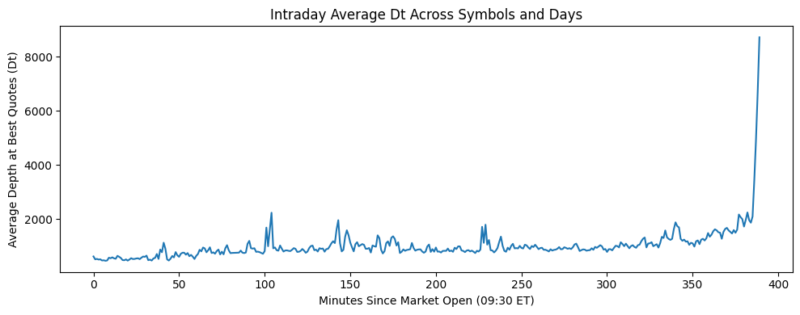
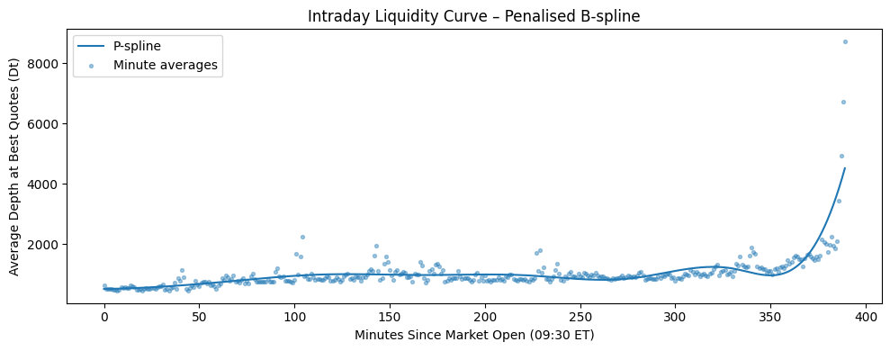
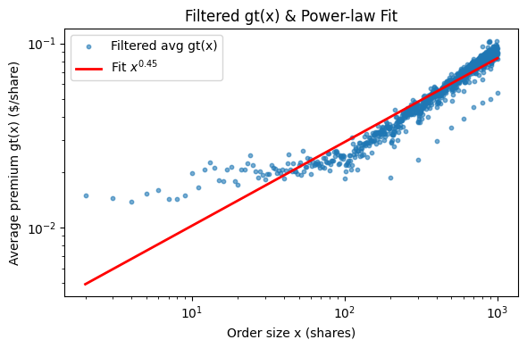

# Intraday Liquidity & Optimal Execution (Work-Trial Task)

This repo builds an intraday liquidity curve from quote data, calibrates a **piecewise temporary impact** model (flat cost up to depth; concave power-law tail), and solves for the **optimal minute-by-minute execution schedule** for a fixed parent order using KKT conditions with a bisection on the Lagrange multiplier.



---

## What’s in here

- **Modeling note** — estimating the flat cost $c$, intraday depth $D_t$, and tail exponent $p$, with plots and rationale.  
- **Allocation note** — KKT-based algorithm with a bisection on the multiplier to hit the target $S$.  
- **Notebook / code** — end-to-end data loading, P-spline smoothing, power-law fit, and final allocation.  
- **`impact_model.py` + `tests/`** — vectorized, tested implementations (2026-08 revision): book-walk premiums without Python loops, scale-free cross-symbol pooling, bootstrap CIs for the exponent, and the KKT allocator with optimality tests. Runs on a synthetic MBP-10 fixture, no proprietary data needed.

## 2026-08 revision notes

- **Scale-free pooling.** The notebook pooled (shares, \$/share premium) pairs across SOUN/FROG/CRWV directly; different price levels and depth scales bias the pooled exponent. `impact_model.walk_book_premiums` normalizes premiums to basis points of the best ask and sizes to multiples of each symbol's median top-of-book depth before pooling (a unit test shows raw-dollar pooling distorts a known exponent while normalized pooling recovers it).
- **Uncertainty.** `fit_power_law` reports a symbol-block bootstrap 95% CI for $p$, not just a point estimate.
- **Scope, stated honestly.** Walking displayed snapshots measures the *virtual instantaneous* cost of consuming visible liquidity. Realized metaorder impact additionally reflects hidden liquidity, queue refill, and adverse selection. The calibrated curve here is a displayed-liquidity lower bound, not a fitted metaorder impact curve — see the section below on which square-root law this can and cannot speak to.
- **Allocator verified.** The per-minute cost is convex (marginal cost steps from $c$ to $(1+p)c$ at $D_t$), so the KKT/bisection solution is globally optimal; tests confirm no pairwise mass transfer improves it and that it matches a fine greedy marginal-cost discretization. The flat-region allocation is degenerate; proportional-to-$D_t$ is the documented tie-break.

### Which square-root law this estimator can speak to

"The square-root law" is really two distinct statements, and conflating them is the usual error. Durin, Rosenbaum and co-authors ([arXiv 2311.18283](https://arxiv.org/abs/2311.18283)) separate them:

1. **In cumulated volume.** *During* execution of a metaorder, impact grows as the square root of the volume executed so far.
2. **In participation rate.** For a *given* total executed volume $Q$, impact scales as $\sqrt{\gamma}$ in the participation rate $\gamma$, once $\gamma$ is large enough.

The exponent fitted here ($\hat{p} \approx 0.45$) is **neither**. It is the concavity of the cost of walking a *static displayed book* against order size: a cross-sectional depth-profile property measured at an instant. It has no time dimension, so it cannot express law 1, and it is indexed by shares rather than by participation in contemporaneous volume, so it cannot express law 2. That $\hat{p}$ lands near $1/2$ is suggestive of common liquidity structure, but it is not confirmation of either law, and this repo does not claim it is.

Evidence for the laws themselves is now strong: a complete survey of the Tokyo Stock Exchange finds square-root scaling across all liquid stocks over eight years ([arXiv 2411.13965](https://arxiv.org/abs/2411.13965)), and Maitrier and Bouchaud ([arXiv 2506.07711](https://arxiv.org/abs/2506.07711)) give a framework reconciling impact, order imbalance and volatility.

Reaching those laws from here needs metaorders, not snapshots: reconstructing proxy metaorders from public data ([arXiv 2503.18199](https://arxiv.org/abs/2503.18199)) and re-indexing $g_t$ on participation of the minute-volume curve. That is the natural next build, alongside a transient-impact propagator — calibrated by regressing returns on lagged signed volumes across multiple lags and choosing kernel parameters to maximise out-of-sample $R^2$ — to replace the memoryless cost model with one that has resilience.

## Testing the square-root law on reconstructed metaorders (2026-09)

The section above explains why the static book-walk exponent tests *neither*
square-root law. `metaorder_impact.py` closes that gap by measuring impact
against **participation rate**, which is the quantity law 2 is stated in.

Metaorders are reconstructed from Databento MBO following the public-data
approach ([arXiv 2503.18199](https://arxiv.org/abs/2503.18199)): a proxy
metaorder is a maximal run of consecutive same-signed fills, since real
metaorders arrive as bursts of one-sided pressure and a run is the closest
observable analogue on anonymous data. Impact is the signed mid change from
immediately before the run to immediately after, normalised by daily volatility.

MSFT 2024-06-03, 9,437 reconstructed metaorders:

| participation γ | impact / σ | n |
|---|---:|---:|
| 0.00000042 | 0.00283 | 882 |
| 0.00000167 | 0.00306 | 761 |
| 0.00001073 | 0.00564 | 787 |
| 0.00004301 | 0.01196 | 790 |
| 0.00009531 | 0.01824 | 783 |
| 0.00025701 | 0.02527 | 787 |

(6 of 12 bins; the full table is written to `reports/metaorder/impact_bins.csv`.)

**Fitted exponent 0.370, R² 0.917** across 12 bins. Impact is clearly concave and
the relationship is clean, but the exponent sits *below* the square-root law's
0.5, not above it.

### This number was 0.788 until 2026-09, and the change is a correction

The earlier figure came from a committed CSV with **no builder behind it**.
`scripts/build_metaorders.py` now reconstructs it from the message stream and
the L1 book, and recovering the construction turned up two defects in the
original file. Neither is reproduced.

1. **Fills sharing a timestamp were reordered.** The old file is not sorted in
   time: it contains a run beginning **59 microseconds before the previous run
   ended**, and it splits one same-signed run into three because a later fill was
   sorted ahead of two earlier ones. Order within a timestamp *is* the sequence
   order and carries information. Building in message order gives 9,437 runs
   against the old 9,439.
2. **`mid_start` was read after the run's first fill rather than before it.**
   The method is stated two paragraphs above as "the signed mid change from
   immediately before the run to immediately after", and measuring from after the
   first fill silently drops that fill's own impact from every metaorder. This is
   the change that moves the number.

Isolating them, on the same 12-bin fit:

| variant | exponent | R² |
|---|---:|---:|
| committed file, as published | 0.788 | 0.948 |
| rebuilt, pre-fix book, mid read *at* the first fill | 0.622 | 0.964 |
| rebuilt, corrected book, mid read *at* the first fill | 0.621 | 0.965 |
| **rebuilt, corrected book, mid read *before* the run** | **0.370** | **0.917** |

Two things worth reading off that table. The **execution-mirror-cancel fix in the
sibling repo turns out to be irrelevant here** — it moves the exponent by 0.001,
so the provenance caveat this section used to carry was pointing at the wrong
culprit. And the mid convention is worth 0.25 of exponent on its own. The
remaining 0.788 → 0.622 gap is the reordering, and it cannot be decomposed
further: no lookup convention tried reproduces the old file's mid columns better
than 89%, so **its construction is not recoverable** and the published 0.788 was
resting on a file nobody could regenerate.

### Why below 0.5, and why that is not a clean test either

The correction does not turn this into a refutation of the square-root law, and
reading it that way would repeat the error the previous version made in the other
direction. The likelier explanation is a **discreteness floor**: a one-fill
"metaorder" still moves the mid by something on the order of half a tick, so
impact does not fall toward zero as participation does. That floor lifts the
smallest bins, flattens the log-log slope and biases the exponent *down*. The old
`at` convention removed the floor by accident — by starting the measurement after
the first fill — which is why it read higher, but it did so by discarding real
impact rather than by fixing anything.

Participation here also spans roughly 1e-6 to 3e-3, two to four orders of
magnitude below the range where the square-root law is documented. Between the
floor at the bottom and the range at the top, this session does not deliver a
clean test of the law in either direction. That is the honest conclusion.

Two further limits: proxy metaorders merge concurrent participants trading the
same way and split a single participant who pauses, and this is one instrument
on one session — the propagator below now covers two, this section does not.

That reconstruction difficulty is itself a documented result rather than a
private worry. Naviglio, Bormetti, Campigli, Rodikov and Lillo
([arXiv 2501.17096](https://arxiv.org/abs/2501.17096)) ask directly why
estimating metaorder impact from public market data is so hard, and find that
models fitted to anonymised public flow produce price trajectories that are
*linear* during execution rather than concave, with too little post-execution
reversion, because they misspecify where order-flow autocorrelation comes from.
The proxy-metaorder construction used here inherits exactly that exposure: a
maximal same-signed run is an assumption about which fills share a parent, and
that assumption is the thing their paper shows is load-bearing.

The estimator is fitted on **bin means**, not raw observations, and the tests
pin why that matters: conditioning on positive impact — which superficially
"cleans up" the data — selects on the dependent variable and biases the
exponent. One test exists purely to demonstrate that bias and fail if the
estimator ever starts filtering.

```bash
python scripts/build_metaorders.py \
    --messages MSFT_2024-06-03_message.csv --book MSFT_2024-06-03_l1.csv \
    --out data/MSFT_2024-06-03_metaorders.csv
python scripts/run_metaorder_impact.py
```

## Transient-impact propagator, calibrated on two sessions (2026-09)

The piecewise model above is **memoryless**: cost at minute t depends only on
size at t. Real impact decays instead of vanishing. `propagator.py` calibrates
the Bouchaud-style kernel

    r_t  =  sum_{l=0..L} G(l) * sign(v_{t-l}) * |v_{t-l}|^delta  +  noise

directly from data, on one-second bars built from Databento `XNAS.ITCH` MBO
(signed volume from book-affecting fills, mid from a reconstructed book).
Kernel parameters are selected by out-of-sample R² on a chronological 70/30
split — nothing is fitted on the evaluation window, and both sessions use the
identical grid and split so they are comparable by construction.

The second session is chosen to be a different kind of book, not a second day of
the same one: MSFT trades at $415 with a one-tick spread 1.0% of the time and
63-68 shares at the touch, while INTC 2024-08-02 trades at $21 with a
one-tick spread 81.1% of the time and 2,400-3,000 shares at the touch. One is
small-tick and spread-dominated, the other large-tick and queue-dominated.

| | MSFT 2024-06-03 | INTC 2024-08-02 |
|---|---:|---:|
| one-second bars | 23,390 | 23,394 |
| **explanatory** OOS R² (contemporaneous flow included) | **0.36599** | **0.43229** |
| — best delta / lags | 0.25 / 60 | 0.25 / 0 |
| memoryless (L = 0, same delta) | 0.36440 | 0.43229 |
| gain from lagged history | +0.00160 | +0.00000 |
| **predictive** OOS R² (lags ≥ 1 only) | **0.00423** | **0.00455** |
| — best delta / lags | 1.0 / 20 | 0.25 / 10 |
| explanatory / predictive ratio | **86x** | **95x** |

The MSFT explanatory figure was **0.371 before 2026-09 and is 0.36599 now**. The
change is not a re-fit: the committed one-second series had been built from a
message stream that predated the execution-mirror-cancel fix in the sibling
`lob-engine-cpp` repository, which double-decremented resting orders on every
displayed fill and corrupted 253 of the 23,390 mid values. Rebuilding it from
the corrected book moved the number. `signed_vol` was unaffected, since that
column reads only displayed-fill events, which the fix does not touch. This is
also why `scripts/build_1s_bars.py` now exists: the series had no committed
builder, which is exactly how a stale input survives unnoticed.

Four findings, all reported as they came out:

1. **Signed order flow explains 37% of contemporaneous one-second returns on
   MSFT and 43% on INTC.** That is impact, and it is large. It is also stable across a
   40x difference in touch depth and a 19x difference in price, which one
   session could not have established.
2. **It predicts almost nothing, on either.** Dropping the contemporaneous term
   collapses out-of-sample R² by a factor of **86** on MSFT and **95** on INTC,
   to under half a percent both times. Contemporaneous explanatory power is not
   tradeable signal, and conflating the two is the standard error this table
   exists to prevent. The pattern matches Cont, Cucuringu and Zhang on order
   flow imbalance: strong contemporaneous relation, weak and fast-decaying
   predictive one.
3. **At one-second resolution the kernel has already decayed — and the second
   session makes that sharper, not weaker.** On MSFT, adding 60 lags of history
   buys +0.0016 R²; on INTC the selected model has **zero** lags and history
   adds nothing at all to five decimal places. Transient impact is real, but at
   this sampling frequency the relaxation has essentially finished inside the
   first bucket, and the more heavily queued book is the one where it is most
   completely finished.
4. **The concavity exponent is identical across the two books.** Both select
   delta = 0.25 for the explanatory fit. That is a stronger statement than
   either session alone: the same degree of concavity in aggregated one-second
   flow shows up in a $415 small-tick name and a $21 large-tick one.

Caveats that bound all four: two instruments, two sessions, and one-second
buckets. The propagator literature usually works in trade or event time, where
slower decay is visible; a one-second grid may simply be too coarse to resolve
it. The fitted delta of 0.25 is more concave than the square-root form, but this
is aggregated interval flow, not metaorders, so it is not a measurement of the
square-root law either — see Maitrier and Bouchaud
([arXiv 2506.07711](https://arxiv.org/abs/2506.07711)) for the framework in
which square-root metaorder impact, linear order-imbalance impact and diffusive
prices are reconciled, which is the setting this measurement sits beside rather
than inside.

Reproduce (the bar series are committed; `build_1s_bars.py` regenerates them
from a Databento extract):

```bash
python scripts/run_propagator.py --data data/MSFT_2024-06-03_1s.csv
python scripts/run_propagator.py --data data/INTC_2024-08-02_1s.csv
```

### Risk-averse extension (Almgren-Chriss)

`impact_model.allocate_schedule_risk_averse` extends the static KKT schedule with the Almgren-Chriss mean-variance objective (impact cost plus $\lambda\sigma^2\sum_t I_t^2$ on remaining inventory), solved as a convex program warm-started from the risk-neutral optimum. `scripts/compare_schedules_demo.py` regenerates `figs/schedule_comparison.png` and a cost/risk table against TWAP and depth-proportional baselines, and exposes a non-obvious property of the piecewise model:

- **Small orders (inside the flat region):** every schedule pays the same flat cost $cS$, so risk aversion is *free*; the AC schedule cuts inventory variance ~10x at zero extra impact cost. The flat-region degeneracy of the risk-neutral problem is exactly what the risk term resolves.
- **Large orders (tail engaged):** a genuine tradeoff appears, e.g. $\lambda=10^{-5}$ cuts inventory variance ~5x for ~61% more impact cost.

Run the tests:

```bash
python -m pytest tests -q
```

Key figures:

  
Penalised cubic B-spline fit to minute-level average depth $D_t$.

  
Filtered average premium $g(x)$ with tail $x^{p}$ (log–log).

---

## Method (at a glance)

1. **Depth curve $D_t$**  
   For each trading minute $t\in\{0,\dots,389\}$, compute the average of the first non-zero ask size per quote event for each symbol–day, then average across panels to get $D_t$. Smooth with a penalized cubic B-spline (GCV selects $\lambda$).

2. **Flat cost $c$**  
   Take the median half-spread per symbol during RTH, then the median across symbols → global $c$.

3. **Impact tail exponent $p$**  
   Build empirical $g(x)$ by averaging the premium paid above best-ask as one walks up the ask ladder; fit  
   $\log g(x)=\log a + p\log x$ on filtered buckets → $p\approx 0.45$.

4. **Piecewise temporary impact $g_t(x)$**

```math
g_t(x)=
\begin{cases}
c, & 0\le x\le D_t\\
a_t\,x^{\,p}, & x>D_t
\end{cases}
\qquad
a_t=\dfrac{c}{D_t^{\,p}},\quad 0<p<1.
