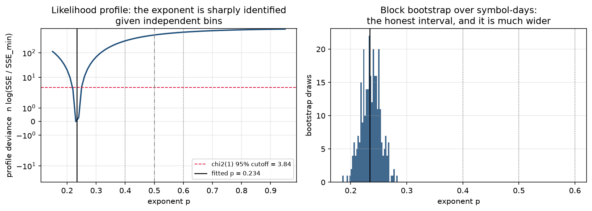

# Intraday impact modelling on Databento XNAS.ITCH

Fifteen symbol-days of Nasdaq order-by-order data, used to answer four questions
about temporary impact: how well can it be predicted for a specific order, what
functional form does the displayed book actually have, where does impact stop
being square-root, and does order flow say anything trade flow does not.

**The sample is 15 symbol-days on three names in 2024**: MSFT, INTC and AAPL,
five sessions each, on a selection rule fixed before any result was looked at.
It contains no market-wide stress day: no CPI print, no FOMC, no August 5th.
One session, INTC 2024-08-02, is a single-name event day (the post-earnings
collapse), and it behaves differently from the other fourteen in almost every
table below, which is said where it happens. Nothing here is a statement about
US equities, about a regime, or about Nasdaq. It is a statement about three
names on fifteen days.

---

## Three different R-squareds, and which one is which

Impact studies report a number called R². It is usually the first of these, and
the first is the one a desk can do least with.

| | what it asks | can it be traded | this repo |
|---|---|---|---|
| **Contemporaneous R²** | how much of the price change over a bin does flow *in that same bin* explain | **No.** The flow is not known until the bin is over. It describes; it cannot be acted on. | 0.198 to 0.542 across sessions |
| **Predictive R²** | how much of the price change does *past* flow explain | **Yes, in principle.** This is the number that would be alpha. | −0.0010 to +0.0056. Positive on 11 of 15 sessions, and never above six thousandths |
| **Conditional impact accuracy** | given an order's size and the seconds it executed over, how close was the *predicted* impact to the *realised* impact of that order, out of sample | **This is what an execution model is for.** Not alpha; cost. | best model reaches R² 0.12 (median), and is 23% miscalibrated |

The README leads with the second and the third. The first is reported because it
is large and because leaving it out would be its own kind of dishonesty, but a
contemporaneous R² of 0.4 is not a signal, and the ratio between the first two
columns, 86x on the first session studied here and at least 10x on all fifteen,
is the single most important thing in this repository.

```bash
pip install -r requirements.txt
python -m pytest tests -q          # 112 tests
```

---

## 1. Transient-impact propagator, and how well it prices a specific order

`propagator.py` calibrates the Bouchaud-style kernel

    r_t  =  sum_{l=0..L} G(l) * sign(v_{t-l}) * |v_{t-l}|^delta  +  noise

on one-second bars built from Databento MBO, choosing `(delta, L)` by
out-of-sample R² on a chronological 70/30 split.

### The headline: conditional impact accuracy

Every reconstructed metaorder starting inside the held-out last 30% of a session
gets a predicted impact from a kernel fitted strictly inside the first 70%,
using only that order's own flow. R² below is of realised on predicted with **no
refit**: the model's own number, not a line drawn through it afterwards.

| model | what it gets to fit in sample | median OOS R² | median slope of realised on predicted |
|---|---|---:|---:|
| propagator, kernel straight off the bars | the whole kernel, on one-second flow | **−2.04** | 0.35 |
| propagator, rescaled on training metaorders | kernel shape, plus one level | **−0.02** | 0.52 |
| square root, `I = c σ_D √(Q/V)` | one level, c | **−0.33** | 0.52 |
| square root, σ from the trailing 30 minutes | one level, c | **+0.12** | 1.23 |

Four things fall out of that table.

1. **A propagator calibrated on bar flow does not transfer to order flow.** Its
   level is wrong by a factor of roughly two and its R² is deeply negative on 14
   of 15 sessions. The kernel is fitted so that `G(0)` explains a whole second's
   aggregate flow; applied to one participant's share of that second it
   over-predicts, and the concavity transform makes it worse, since `|v|^0.25`
   barely distinguishes one participant's volume from everyone's.
2. **The kernel's shape is worth something once the level is fixed.** Give the
   propagator a single scale fitted on training metaorders, the same one
   parameter the square-root model gets, and it beats the square-root model on
   **13 of 15 sessions**, with a pooled calibration ratio between 0.75 and 1.02
   across the middle eight deciles.
3. **The standard square-root model is about 2x miscalibrated intraday**, and the
   direction is systematic: slope 0.52, so a coefficient fitted on the morning
   over-predicts the afternoon roughly twofold. The cause is measurable rather
   than speculative. One-second realised volatility in the held-out window is a
   median 0.63 of the training window's, the slope is a median 0.52, and the two
   correlate at 0.68 across sessions. The model holds σ at a daily constant
   while the market it is applied to gets quieter through the day.
4. **Replacing σ_D with a causal trailing estimate is the only thing that gets
   the sign of the error right.** Volatility over the 30 minutes *before* each
   order, available at decision time with no look-ahead, turns the median R² from
   −0.33 to **+0.12**, the only positive number in the table. It over-corrects:
   the slope goes to 1.23 and the pooled decile ratios sit near 1.5, so the
   trailing one-second estimate falls through the day faster than impact does.
   The calibrated answer is between the two, and neither end is it.

Pooled calibration by predicted-impact decile, propagator with a fitted level:

| decile | predicted | realised | ratio | n |
|---:|---:|---:|---:|---:|
| 0 | 0.000019 | 0.000014 | 0.75 | 5,266 |
| 2 | 0.000038 | 0.000030 | 0.79 | 4,746 |
| 4 | 0.000053 | 0.000047 | 0.87 | 4,772 |
| 6 | 0.000080 | 0.000082 | 1.02 | 4,681 |
| 8 | 0.000185 | 0.000150 | 0.81 | 4,741 |
| 9 | 0.000405 | 0.000249 | 0.61 | 4,759 |

The top decile is where it fails, and that is the decile a desk cares about: the
largest orders are over-predicted by 39%. Full tables in
`reports/conditional_impact/`.

### The two-day numbers, restated across fifteen sessions

The figures this repo used to lead with (explanatory R² 0.366 and 0.432,
predictive 0.004 and 0.005, metaorder exponent 0.370) were each **one
symbol-day**. The same code on fifteen reproduces them exactly on the sessions
they came from, and puts them in context:

| | MSFT | INTC | AAPL |
|---|---|---|---|
| contemporaneous OOS R², range | 0.198 to 0.437 | 0.364 to 0.542 | 0.309 to 0.437 |
| mean, bootstrap band by symbol-day | 0.293 [0.212, 0.375] | 0.437 [0.387, 0.495] | 0.371 [0.327, 0.415] |
| predictive OOS R², range | −0.0010 to 0.0045 | −0.0004 to 0.0046 | −0.0002 to 0.0056 |
| mean, bootstrap band | 0.0016 [−0.0005, 0.0037] | 0.0020 [0.0006, 0.0035] | 0.0016 [0.0003, 0.0036] |
| metaorder exponent, range | 0.318 to 0.398 | 0.209 to 0.467 | 0.286 to 0.487 |
| mean, bootstrap band | 0.351 [0.327, 0.376] | 0.335 [0.264, 0.409] | 0.357 [0.299, 0.432] |

- The **explanatory-versus-predictive gap holds on 15 of 15 sessions** (the
  contemporaneous R² is at least ten times the absolute predictive one every
  time). This is the finding that survives the panel.
- Predictive OOS R² is **positive on 11 of 15**; on the other four the best
  lagged model is worse than predicting the mean.
- Adding lagged history to the contemporaneous model buys a median +0.0031 and
  at most +0.0154. At one-second resolution the relaxation has essentially
  finished inside the first bucket.
- The metaorder exponent is **below 0.5 on 15 of 15**, mean 0.348, bootstrap
  band by symbol-day [0.314, 0.382]. The single-session 0.370 was not unusual;
  what it lacked was the range around it.

The per-stock means differ by less than the within-stock spread. Reading the
INTC-versus-MSFT contrast as a large-tick-versus-small-tick effect, as an
earlier version of this README did, does not survive five sessions each.

```bash
python scripts/run_conditional_impact.py
python scripts/run_propagator_panel.py
```

---

## 2. The original functional form, refitted without filtering

The work-trial notebook fitted `g(x) = a x^p` to the cost of walking a displayed
ask ladder and reported **p ≈ 0.45**. That number is retired. Its figures are
gone from this README; the refit below is on Databento MBP-10, on all fifteen
sessions, with nothing filtered.

`bookwalk.py` walks both sides of the vendor's ten displayed levels at the last
book state of every RTH second, about 23,300 snapshots a session, over a fixed
log grid of sizes in shares, filling the marginal level partially. **x is capped
by displayed depth**: a snapshot contributes to size x only if its ten levels
hold x shares, so every fit below is valid strictly inside the displayed-depth
range, and the `participating` column records the fraction of snapshots that
qualify at each size.

### (a) What the filter was worth

The notebook's recipe made three choices at once: integer-share buckets of the
premium over the best *ask*, every bucket above 1,000 shares dropped, and
survivors weighted equally regardless of how many snapshots they held.

| | filtered, as published | unfiltered | unfiltered, count-weighted |
|---|---:|---:|---:|
| mean exponent across 15 sessions | 0.355 | 0.334 | 0.595 |
| range | **−0.061 to 0.581** | 0.149 to 0.569 | 0.416 to 0.760 |
| standard deviation | 0.180 | 0.121 | 0.082 |

The filter does not move the exponent so much as destroy its stability. The
1,000-share cap discards a **median 73.8% of observations**, and on the
large-tick name it is catastrophic: INTC has 2,500 to 4,200 shares at the touch
alone, so the cap keeps only the first level or two. On INTC 2024-10-01 it
leaves **37 buckets out of 72,234, discarding 99.98% of the data, and the fitted
exponent comes out negative.** Count-weighting the surviving buckets, the
third column, is a separate choice and moves the mean by more than the cap does.

### (b) Nine normalisations, all reported

| size | cost | exponent | robust SE | bootstrap 95% | weighted R² |
|---|---|---:|---:|---|---:|
| shares | bp of mid | 0.533 | 0.012 | [0.473, 0.584] | 0.851 |
| shares | σ_D | 0.312 | 0.017 | [0.230, 0.379] | 0.714 |
| shares | half-spreads | 0.273 | 0.008 | [0.242, 0.331] | 0.668 |
| x / ADV | bp of mid | 0.564 | 0.018 | [0.502, 0.639] | 0.824 |
| x / ADV | σ_D | 0.336 | 0.020 | [0.255, 0.404] | 0.749 |
| x / ADV | half-spreads | 0.295 | 0.009 | [0.260, 0.345] | 0.679 |
| x / D_t | bp of mid | 0.200 | 0.029 | [0.160, 0.243] | 0.149 |
| x / D_t | σ_D | 0.220 | 0.017 | [0.192, 0.254] | 0.479 |
| **x / D_t** | **half-spreads** | **0.234** | **0.015** | **[0.203, 0.268]** | **0.595** |

ADV is the trailing 20-day Nasdaq average daily volume; D_t is the displayed
size at the touch in that snapshot; σ_D is the trailing 20-day close-to-close
volatility.

Both axes move the exponent and neither is a free choice. Sizes in shares and in
ADV differ only by a per-session constant, so they nearly agree; dividing by D_t
does not, because displayed depth varies second by second and dividing by it
removes exactly the part of the size the book was deep enough to absorb cheaply.
On the cost side, only a *global* constant rescale leaves an exponent alone: σ_D
is constant within a session but differs across them, and the half-spread varies
snapshot by snapshot, so both reweight the pooled fit.

**The range across the nine is 0.200 to 0.564, and 0.45 sits inside it.** That is
the finding. The work-trial number was one cell of this table reported as the
answer.

The bottom row is the pooled fit, and it is the only kind of pooling that is
legitimate: both axes dimensionless, as `impact_model.py`'s docstring requires.
A cost in basis points is *not* scale-free across a $21 large-tick name and a
$420 small-tick one, which is why the `x/D_t` and bp row has a weighted R² of
0.15, where the pooled fit is mostly fitting the difference between the names.

### (c) Five forms, scored by cross-validation and AIC

Pooled, `u = x/D_t`, `y` in half-spreads, 600 bins over 15 symbol-days. Weighted
nonlinear least squares with bin-count weights and HC0 sandwich errors; folds
are whole symbol-days, because bins inside one session share a book and a random
split would leak.

| form | parameters | exponent | LOSO RMSE | ΔAIC |
|---|---|---:|---:|---:|
| **piecewise flat + power** | c=1.00, u₀=0.0795, p=0.245 | 0.245 [0.214, 0.280] | **1.074** | **0** |
| power law | a=1.93, p=0.234 | 0.234 [0.203, 0.268] | 1.088 | 17.6 |
| ATHL, β free | η=1.93, β=0.234 | 0.234 [0.203, 0.268] | 1.088 | 17.6 |
| logarithmic | k=0.864, u₀=0.139 | none | 1.098 | 26.2 |
| ATHL, β = 3/5 | η=0.363 | fixed at 0.6 | 1.915 | 712.9 |
| linear | b=0.0252 | fixed at 1 | 2.360 | 966.4 |

The original piecewise form wins, on both criteria, and the reason is specific:
its fitted breakpoint is **u₀ = 0.0795, not 1**. The model as written in
`impact_model.py` puts the flat region at exactly one unit of displayed depth;
the data puts it at about a *twelfth* of it. The flat cost `c` comes out at
1.000 half-spreads, which is the model's own consistency check passing (walking
zero shares costs exactly the half-spread) and is not fitted to be so.

Linear impact is rejected decisively (ΔAIC 966) and so is Almgren, Thum,
Hauptmann and Li's β = 3/5 (ΔAIC 713). Per symbol the exponents are AAPL 0.273,
INTC 0.284, MSFT 0.169, and on AAPL alone the logarithmic form wins the
cross-validation.

**Truncation bias, measured.** At large x only the deepest snapshots can fill,
and deep books are cheap to walk, so the measured curve flattens and the
exponent is biased down. Restricting to bins where at least 90% of snapshots had
the depth, 505 of 600 bins, moves the exponent **0.234 to 0.334**. That is the
largest single correction in this section and it goes the way the bias predicts.

### (d) Is the exponent identified?



| | |
|---|---|
| point estimate | 0.234 |
| HC0 robust standard error | 0.015 |
| profile 95% interval | [0.220, 0.240] |
| **block bootstrap 95% interval, by symbol-day** | **[0.203, 0.268]** |
| profile deviance at p = 0.4 / 0.5 / 0.6 | 309 / 536 / 697 (χ²(1) cutoff 3.84) |

Yes, and easily. The profile is sharply curved: 0.4, 0.5 and 0.6 are rejected by
two orders of magnitude more than the χ² cutoff. **The data separates 0.23 from
0.45 without difficulty, and 0.45 lies outside every interval in this section.**

What the profile is not is an honest interval. It is **3.2x narrower than the
block bootstrap**, because it treats 600 bins as 600 independent observations
when they are 15 sessions. Quote the bootstrap. The robust standard error, for
once, happens to agree with it.

### What this measures, and what it does not

Walking a displayed book measures the **virtual instantaneous cost of consuming
visible liquidity at an instant**: no hidden size, no queue refill, no adverse
selection, no time dimension at all. It is a **lower bound** on realised impact.
It is in its own section, away from the metaorder results, for that reason, and
none of the exponents above is a measurement of any square-root law.

```bash
python scripts/run_bookwalk.py
```

---

## 3. Metaorders: where the square root starts, and a published comparison

`metaorder_impact.py` measures impact against participation rate on proxy
metaorders, maximal runs of same-signed fills, following
[arXiv 2503.18199](https://arxiv.org/abs/2503.18199). Across the fifteen
sessions the fitted exponent is **0.209 to 0.487, mean 0.348, below 0.5 every
time**.

### The crossover

Bucci, Benzaquen, Lillo and Bouchaud
([PRL 123, 106401, 2019](https://arxiv.org/abs/1901.05332)) argue the square-root
law must break down at small participation, becoming linear below a crossover
where the metaorder is comparable to the volume traded while the book relaxes.
That would explain an exponent below 0.5 with nothing wrong. The competing
explanation is a **discreteness floor**: a one-fill metaorder still moves the mid
by about half a tick, so the smallest bins cannot fall below that level and the
fitted slope flattens.

`crossover.py` fits both regimes joined continuously, with the crossover q\* by
profile likelihood. The two explanations are distinguishable, and the test is
whether the impact *at* the crossover is above one tick.

On the 187,073 fill-run metaorders:

| panel | q\* (fraction of daily volume) | impact there, in ticks | interior estimate? |
|---|---:|---:|---|
| pooled | 8.7e-08 | 0.11 | **no, pinned at the grid floor** |
| AAPL | 6.7e-08 | 0.12 | no |
| INTC | 8.1e-08 | 0.03 | no |
| MSFT | 1.4e-07 | 0.29 | no |

q\* lands at the bottom of the search grid, about **one share**, and the fitted
impact there is **a tenth of a tick**. Both facts say the same thing: there is no
linear regime anywhere in this range, and the range itself lies below the price
grid's own resolution. Bucci's crossover cannot be what produces the 0.348
exponent here. Under their account this range should be *linear*, exponent 1,
and it is nowhere near.

Run the same fit on metaorders large enough to be visible and the crossover
appears:

> On the published-recipe metaorders (1,176 orders, participation 1e-4 and up),
> **q\* = 2.8e-4 of daily volume, with impact at the crossover of 8.2 ticks,
> an interior estimate far above the discreteness floor.**

So both things are true, at different scales. A crossover exists, at about 2.8
parts in ten thousand of daily volume. The fill-run reconstruction lives four
orders of magnitude below it, entirely inside the tick floor, and **the sub-0.5
exponent it produces is the floor, not the crossover.** That is the explanation
this analysis supports.

### Beside a published result

[arXiv 2606.24019](https://arxiv.org/abs/2606.24019) confirms the square-root law
on AAPL over 178 trading days. `crossover.bin_metaorders` implements its recipe:
30-second bins, direction dominance above 0.3, duration at least 60 seconds,
size at least 1e-4 of daily volume, then `I/σ_D = c (Q/V_D)^δ`.

| | c (δ fixed at ½) | δ free |
|---|---|---|
| **published, AAPL, 178 days** | **c_raw 0.69** [0.63, 0.77] | **0.50** [0.32, 0.66] |
| ours, AAPL, 5 days, 250 metaorders | 1.68 [1.08, 2.44] | 0.34 [0.28, 0.44] |
| ours, pooled, 1,176 metaorders | 1.86 [1.55, 2.23] | 0.39 [0.33, 0.48] |
| ours, INTC | 1.52 [1.32, 1.85] | 0.36 [0.25, 0.50] |
| ours, MSFT | 2.58 [2.27, 2.89] | 0.62 [0.56, 0.73] |

Our AAPL exponent, 0.34, is below their 0.50 and its interval **does not contain
0.50**, though the two intervals overlap between 0.32 and 0.44. Our prefactor is
**2.4x theirs**, and that gap is not explained by the venue-volume convention:
using consolidated rather than Nasdaq volume would raise our c further, not lower
it. Five days against 178 is the obvious candidate, and MSFT's 0.62 against
AAPL's 0.34 shows how much of that spread is available across three names.

Their bias-corrected prefactor, c_eff 0.34, is **not recomputed here**. The
abstract states it without stating the correction, and inventing a correction
that lands on 0.34 would be fitting to the answer.

### Two limits that do not go away

Proxy metaorders merge concurrent participants trading the same way and split a
single participant who pauses. Naviglio, Bormetti, Campigli, Rodikov and Lillo
([arXiv 2501.17096](https://arxiv.org/abs/2501.17096)) show that models fitted to
anonymised public flow produce price trajectories that are linear during
execution rather than concave, precisely because they misspecify where order-flow
autocorrelation comes from. A maximal same-signed run is an assumption about
which fills share a parent, and that assumption is the load-bearing one.

```bash
python scripts/run_crossover.py
```

---

## 4. Scheduling: the optimal trajectory for the fitted kernel

With a linear propagator the expected cost of a schedule is `½ x' M x` with
`M[s,t] = G(|t−s|)`, and Gatheral, Schied and Slynko
([Mathematical Finance 22, 2012](https://doi.org/10.1111/j.1467-9965.2011.00478.x))
give the minimiser in closed form: `x* = S M⁻¹1 / (1'M⁻¹1)`. Obizhaeva and Wang
([JFM 16, 2013](https://doi.org/10.1016/j.finmar.2012.09.001)) is the
exponential-kernel special case, whose solution is the familiar bucket: a block
at each end, a constant rate between.

`execution.py` refits the kernel with **delta fixed at 1**, because the GSS
solution needs impact linear in size and deriving a schedule from a linear theory
while pricing it with a concave kernel would be an inconsistency dressed as a
result. Schedules are replayed over 600-second windows at 40 start times inside
each session's held-out 30%, at 0.5%, 1% and 2% of session volume, for 1,800
replays in all.

**The circularity, stated plainly: the propagator prices the impact of the
schedule it chose.** There is no counterfactual price path for an order that was
never sent. That is exactly why the comparison runs against held-out bars, and
why the number below is a saving under a model, not money.

Cost per share splits into two parts, and reporting only the total would be
reporting luck:

| | TWAP | propagator-optimal | Almgren-Chriss (κ=0.005) |
|---|---:|---:|---:|
| **impact** cost per share, 1% order | $0.002463 | $0.002463 | $0.003824 |
| saving vs TWAP, as a fraction of TWAP's impact cost | n/a | **−0.000%** [−0.000%, −0.000%] | **−55.2%** [−78.2%, −32.3%] |
| **drift** cost per share | −$0.007654 | −$0.007655 | −$0.005648 |
| remaining-inventory variance, relative to TWAP | 1.000 | 1.000 | **0.486** |

- **The propagator-optimal schedule is TWAP.** Not approximately: the fitted
  linear kernel selects L = 1 on 9 of 15 sessions and never more than 5, and
  `G(1)/G(0)` runs between −0.11 and +0.11. A kernel that memoryless makes `M`
  nearly a multiple of the identity, whose constrained minimiser is the flat
  schedule. The realised difference is at the 1e-9 dollar level and is very
  slightly *negative*, because the optimum minimises the model's quadratic while
  the replay weights by realised prices. There is nothing here to win.
- **Almgren-Chriss buys risk with cost, and the exchange rate is measurable.**
  Front-loading costs 55% more impact and halves remaining-inventory variance.
  That is the textbook tradeoff with both sides in units, on held-out data.
- **Drift dominates.** The realised move between arrival and fill is three times
  the impact cost and is not controlled by any schedule; on the total-cost line
  the Almgren-Chriss band spans zero. Comparing schedules on total cost is
  comparing which one got luckier.
- **No fitted kernel was indefinite** on any of the 15 sessions: the smallest
  eigenvalue of `M` was positive every time, so none of these kernels admits a
  round trip with negative expected cost. The check is in
  `reports/schedule/kernel_diagnostics.csv` rather than assumed.

```bash
python scripts/run_schedule_oos.py
```

---

## 5. Order flow against trade flow

Signed trade volume counts executions. Order flow imbalance counts the whole
displayed book, arrivals and cancellations and executions, so it moves when a
quote is pulled and no trade happens. `orderflow.py` puts both in the same
one-second regressions, on the same 70/30 split. The per-level increment and the
PCA integration are **vendored from `scripts/multi_level_ofi.py` in the sibling
`lob-engine-cpp` repository**, with attribution in the module docstring;
they implement Cont, Kukanov and Stoikov (2014) and Cont, Cucuringu and Zhang
(Quantitative Finance 2023). Two changes are noted at the call site: the CCZ
depth normalisation is applied, and the principal component is fitted on
training rows only.

Both flows enter as `sign(v)|v|^0.5`, **fixed in advance, not selected**. That
choice is forced and the evidence is reported rather than hidden:

| | δ=0.25 | δ=0.5 | δ=0.75 | δ=1.0 |
|---|---:|---:|---:|---:|
| OFI, mean in-sample R² | 0.431 | 0.587 | 0.633 | 0.537 |
| OFI, mean **out-of-sample** R² | 0.261 | **0.361** | 0.215 | **−0.351** |
| trade, mean out-of-sample R² | **0.340** | 0.226 | 0.042 | −0.117 |

For OFI the in-sample fit rises almost to the linear specification while the
held-out fit collapses: on MSFT 2024-04-01, +0.65 in sample and −3.15 out of it. Both flows are heavy-tailed and no inner split rescues the choice, because
whichever window does the choosing has its own extremes. **The standard
specification, linear in OFI, is the one that fails worst out of sample.**

Mean across the 15 symbol-days, bootstrap band by symbol-day, best-level OFI:

| relation | trade alone | OFI alone | both | trade given OFI | **OFI given trade** | OFI wins |
|---|---:|---:|---:|---:|---:|---:|
| contemporaneous | 0.226 [0.160, 0.288] | **0.361** [0.252, 0.457] | 0.385 [0.290, 0.469] | 0.024 [−0.003, 0.050] | **0.159** [0.086, 0.224] | 13/15 |
| predictive | −0.0007 | −0.0002 | −0.0007 | −0.0005 | 0.0000 [−0.0015, 0.0015] | 10/15 |

- **Contemporaneously, OFI subsumes trade flow.** It adds +0.159 given signed
  trade volume; trade volume adds +0.024 given OFI, and that interval contains
  zero. This reproduces Cont, Cucuringu and Zhang on three names they did not
  study. The integrated multi-level variable is better still, reaching 0.64 on
  MSFT 2024-06-03 against 0.23 for trade flow.
- **Predictively, neither says anything.** Both mean R²s are within a thousandth
  of zero and the incremental contribution of OFI given trade flow is 0.0000
  with a band straddling zero. The whole gain from measuring the book instead of
  the tape is contemporaneous, which is to say it is not tradeable.
- INTC 2024-08-02, the single-name event day, is the one session where trade
  flow beats OFI outright contemporaneously, 0.207 against −0.160.

```bash
python scripts/run_flow_comparison.py
```

---

## Repository layout

| | |
|---|---|
| `bookwalk.py` | displayed-ladder cost, five candidate forms, WNLS with robust errors, LOSO CV, block bootstrap, likelihood profile |
| `conditional_impact.py` | predicted versus realised impact of a given order, out of sample |
| `crossover.py` | two-regime fit with the crossover by profile likelihood, plus the published recipe |
| `execution.py` | GSS optimal schedule for the fitted kernel, replayed on held-out bars |
| `orderflow.py` | multi-level OFI (vendored, attributed) beside trade flow |
| `propagator.py` | the transient-impact kernel |
| `metaorder_impact.py` | impact against participation on reconstructed metaorders |
| `impact_model.py` | the original piecewise model and the Almgren-Chriss allocator |
| `panel.py` | one loader for the fifteen sessions |
| `scripts/build_*.py` | raw vendor data to committed derived series |
| `scripts/run_*.py` | derived series to the tables above |
| `data/`, `reports/` | derived aggregates and results; see `DATA.md` |

Everything in sections 1 to 5 reproduces from the committed derived data with no
credentials and no vendor SDK. Rebuilding those series from raw extracts needs
`requirements-extract.txt`, the shared Databento raw directory, and the sibling
`lob-engine-cpp` checkout.
